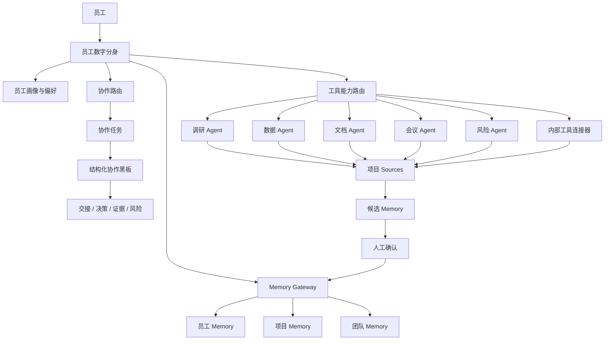

# TwinMesh：企业员工数字分身协同网络

## 0. 项目一句话

**TwinMesh 为每位员工配备一个可授权、可审计、可协作的数字分身，让组织里的知识、任务、工具和经验自动连接起来，形成可持续进化的企业智能协作网络。**

---

## 1. 项目背景

企业内部并不缺工具，也不缺系统，更不缺沟通渠道。真正的问题是：

- 项目上下文散落在群聊、会议、文档、需求、评论和业务系统里。
- 员工每天重复解释背景、同步信息、找资料、催确认。
- 项目经验难沉淀，换人后大量知识断层。
- AI 工具越来越多，但大多数停留在单点问答，无法进入真实协作流程。
- 复盘文档经常写完就沉睡，无法变成下一个项目可用的团队经验。

TwinMesh 的核心判断是：**企业不需要更多孤立的聊天机器人，而需要一套能把员工、项目、工具和组织知识连接起来的数字分身协作网络。**

---

## 2. 项目定位

### 2.1 项目名称

**TwinMesh：企业员工数字分身协同网络**

备选英文定位：**Enterprise Digital Twin Collaboration Network**

### 2.2 产品定位

TwinMesh 是面向企业内部知识工作者的 AI 协作底座。它为每位员工建立一个数字分身，分身理解员工偏好、项目上下文和团队经验，可以调用公司提供的通用 Agent 能力，并与其他员工的数字分身围绕项目任务自主协作。

### 2.3 核心口号

- 让每个员工都有分身，让每个团队拥有记忆。
- 从个人提效，到项目沉淀，到组织智能。
- 不是更多 AI 工具，而是让 AI 进入企业协作网络。
- 让经验不再流失，让协作自动发生。

---

## 3. 核心价值主张

TwinMesh 解决的不是“AI 能不能回答问题”，而是“企业如何把人、工具、项目经验和团队知识组织起来”。

核心价值：

1. **个人提效**：员工分身帮助个人理解上下文、整理资料、生成草稿、提醒风险。
2. **项目提效**：项目 memory 保存事实、决策、工具结果和会议结论，减少重复同步。
3. **团队复利**：项目经验沉淀为团队 memory，后续项目可复用。
4. **工具聚合**：调研、数据、文档、会议、风险、内部系统能力统一通过分身调用。
5. **协作可追踪**：分身之间围绕任务结构化协作，所有证据、决策、交接可审计。
6. **知识可治理**：AI 输出默认是候选内容，经过确认后才成为正式组织知识。

---

## 4. 核心产品概念

### 4.1 员工数字分身

每个员工都有一个自己的数字分身。它不是普通聊天机器人，而是员工的工作代理。

它能做：

- 记住员工的工作偏好、专业领域、历史项目、常用判断标准。
- 帮员工理解项目上下文、整理信息、生成草稿、提醒风险。
- 在授权范围内向其他员工分身发起协作。
- 调用系统通用能力，例如调研、数据查询、文档解析、会议总结、风险审核。
- 将有价值的信息沉淀为员工、项目、团队三级 memory。

它不能做：

- 不能绕过员工权限。
- 不能自动暴露员工私人信息。
- 不能把 AI 生成内容直接写成组织事实。
- 不能无限制地和其他分身互聊。

### 4.2 通用 Agent 能力池

系统不为每个员工重复造 Agent，而是提供一组通用能力：

| 能力 | 说明 |
| --- | --- |
| 调研 Agent | 竞品、用户研究、市场趋势、资料检索 |
| 数据 Agent | 业务指标查询、数据解释、报表总结 |
| 文档 Agent | 文档解析、知识问答、版本对比 |
| 会议 Agent | 实时纪要、行动项、决策提取 |
| 风险 Agent | 版权、合规、敏感信息、外部引用风险 |
| 工具连接器 | O2、Oxygen、JoySpace、知识库、内部系统 |

员工分身像调用公司公共服务一样调用这些能力。

### 4.3 分身协作网络

数字分身之间不是随意聊天，而是围绕任务协作。

每次协作都有：

- 目标：要解决什么问题。
- 背景：来自哪个项目、需求、会议或文档。
- 责任人：当前由哪个分身推进。
- 证据：工具结果、文档引用、会议结论。
- 决策：谁确认了什么。
- 交接：下一步交给谁。
- 记忆沉淀：哪些内容值得进入项目或团队 memory。

这让 AI 协作可追踪、可审计、可复盘。

---

## 5. 三级 Memory 设计

TwinMesh 的正式 memory 分三层：员工 memory、项目 memory、团队 memory。临时会话上下文只作为运行时 scratchpad，不进入正式 memory。

### 5.1 员工 Memory

保存员工个人维度的信息：

- 工作偏好
- 专业领域
- 历史项目经验
- 常用决策标准
- 私人备忘
- 对某类问题的处理习惯

价值：

- 分身越来越懂员工。
- 新项目中能复用个人经验。
- 员工不用反复向 AI 解释自己是谁、关注什么。

### 5.2 项目 Memory

保存项目维度的信息：

- 项目背景
- 需求变更
- 关键决策
- 会议结论
- 调研结果
- 风险判断
- 工具输出
- 阶段总结

价值：

- 项目上下文不再依赖某个人脑子。
- 新成员加入可以快速理解项目。
- 项目推进中减少重复同步。

### 5.3 团队 Memory

保存跨项目、跨人员可复用的组织经验：

- 设计原则
- 业务方法论
- 常见风险模式
- 复盘经验
- 最佳实践
- 反例和适用边界

价值：

- 项目经验变成团队资产。
- 团队能力不会随人员流动流失。
- 新项目可以从历史经验中获得建议。

### 5.4 Memory 治理原则

- AI 输出默认不是事实，只能先成为候选 memory。
- 员工 memory 默认私有。
- 项目 memory 需要项目成员确认。
- 团队 memory 需要负责人确认。
- 所有引用、确认、拒绝、修改、归档都要留痕。
- 每条团队 memory 必须保留来源项目和适用边界。

---

## 6. 核心能力架构

架构分层：

1. **员工入口层**：员工与自己的数字分身交互，支持自然语言、项目入口、任务入口、会议入口。
2. **数字分身层**：理解员工身份、权限、偏好和当前任务，决定检索 memory、调用工具或发起协作。
3. **协作协议层**：管理分身之间的任务请求、证据、决策、风险、交接，避免 Agent 自由互聊失控。
4. **能力路由层**：根据任务类型和权限调用通用 Agent 能力，长任务写入运行记录，输出回流项目上下文。
5. **Memory Gateway**：统一管理员工、项目、团队 memory 的检索、写入、候选、确认、引用审计。
6. **治理与审计层**：权限、风险等级、人工确认、操作日志、引用链路。

---

## 7. MVP 范围

黑客松 MVP 只证明一个闭环：

> 一个员工分身能代表员工理解项目，向另一个员工分身发起协作，调用一个通用工具，产出项目结论，并沉淀为候选 memory。

### 7.1 MVP 必做能力

1. **员工数字分身主页**：显示员工画像、可用工具、近期 memory、待处理事项。
2. **项目上下文**：展示当前项目背景、文档、会议结论、已有项目 memory。
3. **分身协作任务**：A 分身向 B 分身发起 request，B 分身返回 evidence，A 分身生成 digest。
4. **通用工具调用**：至少接一个模拟或真实工具，调研、文档解析、数据查询任选其一。
5. **Memory 候选确认**：协作结果生成项目 memory candidate，用户确认后进入项目 memory。
6. **可视化协作链路**：展示谁问了谁、调用了什么工具、引用了什么证据、产生了什么结论。

### 7.2 MVP 不做

- 不做全自动团队 memory。
- 不做复杂权限系统。
- 不做 Agent 自由群聊。
- 不做外部系统写回。
- 不做多模型调度平台。
- 不做复杂低代码 Agent 搭建器。

---

## 8. 日常工作典型流程

### 8.1 新人快速加入项目

过去：新人进群、找文档、翻会议纪要、问产品、问设计、问研发，花 1–3 天才能理解项目背景。

使用 TwinMesh 后：

1. 新人打开项目。
2. 自己的数字分身读取项目 memory。
3. 分身生成“项目 10 分钟上手包”。
4. 分身标出关键决策、当前风险、待确认事项。
5. 新人可追问：“为什么当时不选方案 B？”
6. 分身引用历史会议和决策记录回答。

解决问题：降低新人 onboarding 成本，减少老成员重复答疑，项目背景不再依赖人肉传帮带。

### 8.2 设计师发起需求理解

过去：设计师读 PRD，不确定用户痛点，找产品、找用研、找历史案例，IM 里来回沟通，资料散落，结论不沉淀。

使用 TwinMesh 后：

1. 设计师问自己的分身：“这个改版最核心的用户痛点是什么？”
2. 分身读取项目 memory 和 PRD。
3. 发现缺少用研证据。
4. 分身向用研同学的分身发起 request。
5. 用研分身调用调研 Agent，返回用户反馈摘要和来源。
6. 设计师分身汇总为“设计输入结论”。
7. 设计师确认后沉淀为项目 memory。

解决问题：缩短需求理解时间，减少跨角色沟通成本，让调研证据进入项目上下文。

### 8.3 会议后自动沉淀

过去：开完会，有人手写纪要，行动项散落在群里，决策没人维护，两周后大家忘了为什么这么定。

使用 TwinMesh 后：

1. 会议 Agent 生成纪要、行动项、决策点。
2. 参会人的数字分身检查与自己相关的行动项。
3. 项目负责人分身确认关键决策。
4. 系统生成项目 memory candidate。
5. 确认后写入项目 memory。
6. 后续任何人问“这个决策为什么这么做”，都能追溯到会议来源。

解决问题：会议不再只是一次性沟通，决策可追溯，行动项更容易落地。

### 8.4 项目复盘变团队经验

过去：项目结束后写复盘，文档放在某个目录，后续项目很少有人再看，同样的坑反复踩。

使用 TwinMesh 后：

1. 项目结束时，分身从项目 memory 中提取可复用经验。
2. 生成团队 memory candidate。
3. 团队负责人确认适用场景和反例。
4. 写入团队 memory。
5. 后续类似项目启动时，员工分身主动提示历史经验。

解决问题：复盘真正进入组织能力，跨项目经验复用，减少重复踩坑。

---

## 9. 解决的实际工作问题

### 9.1 信息分散

问题：信息在聊天、会议、文档、系统、工具结果中割裂，找资料比做判断还费时间。

解决：数字分身统一读取项目上下文，工具结果回流为项目 source，关键结论进入 memory。

### 9.2 协作成本高

问题：跨角色沟通依赖 IM，背景反复解释，责任和结论不清楚。

解决：分身之间用结构化任务协作，每次协作有 request、evidence、decision、handoff，项目中能看到完整协作链路。

### 9.3 经验无法沉淀

问题：老员工经验在脑子里，项目结束后知识流失，新项目不能复用历史经验。

解决：员工、项目、团队三级 memory，项目经验可投影为团队经验，后续项目自动检索相关 memory。

### 9.4 AI 工具碎片化

问题：各类 AI 工具彼此独立，输出结果不进入业务流程，工具调用缺少权限和审计。

解决：通用 Agent 能力池，数字分身按权限调用工具，工具结果进入项目上下文和候选 memory。

### 9.5 人员流动导致知识断层

问题：项目换人后，历史决策和隐性背景丢失，新人要重新问一遍。

解决：项目 memory 保存关键事实和决策，团队 memory 保存可复用经验，新成员由分身快速生成 onboarding 包。

---

## 10. 对公司的价值、提效与收益

### 10.1 价值总览

TwinMesh 从三个层面创造价值：

- **员工层面**：减少找资料、写总结、重复解释、跨人确认的时间。
- **项目层面**：让项目背景、决策、风险、资料和结论可追踪、可复用。
- **组织层面**：把项目经验沉淀为团队能力，降低人员流动和知识断层风险。

### 10.2 可量化提效指标

| 指标 | 当前问题 | 目标收益 |
| --- | --- | --- |
| 新人项目上手时间 | 依赖人工讲解 | 降低 30%–50% |
| 项目背景重复同步 | 高频重复沟通 | 减少 40% |
| 会议纪要与行动项整理 | 手工处理 | 节省 50% 以上 |
| 历史资料查找时间 | 跨系统搜索 | 降低 30%–60% |
| 项目经验复用率 | 复盘难复用 | 显著提升 |
| AI 输出可追溯率 | 来源不清 | 接近 100% 来源链路 |

### 10.3 收益模型

假设试点团队 100 人，每人每天节省 30 分钟，每月工作 22 天：

- 每天节省 50 人小时。
- 每月节省 1100 人小时。
- 相当于释放约 6–7 个全职人力的时间。
- 更重要的是，节省的是高价值脑力劳动时间：找资料、同步背景、整理结论、重复解释。

长期收益：

- 经验可复用。
- 项目风险更早暴露。
- 决策质量提升。
- 新人培养周期缩短。
- AI 工具投入形成复利。

---

## 11. 与普通 AI 助手的区别

| 能力 | 普通 AI 助手 | TwinMesh |
| --- | --- | --- |
| 身份 | 泛用机器人 | 员工数字分身 |
| 上下文 | 当前对话 | 员工 + 项目 + 团队 memory |
| 协作 | 人自己转述 | 分身之间结构化协作 |
| 工具 | 单点调用 | 通用能力池 + 权限路由 |
| 沉淀 | 聊天记录 | 候选 memory → 确认 → 组织知识 |
| 治理 | 弱 | 权限、审计、来源链路 |
| 价值 | 单次提效 | 组织智能复利 |

普通 AI 助手解决的是“我问它答”。TwinMesh 解决的是“员工、项目、团队如何一起变聪明”。这是单点工具和组织系统的区别。

---

## 12. 未来发展前景

### 阶段一：个人分身

- 每个员工有自己的工作分身。
- 支持个人记忆、项目问答、工具调用。

### 阶段二：项目协作网络

- 分身之间围绕项目任务协作。
- 项目 memory 自动增长。
- 项目作战室可追踪协作链路。

### 阶段三：团队智能沉淀

- 项目经验投影为团队 memory。
- 新项目自动召回历史经验。
- 团队形成持续学习机制。

### 阶段四：企业级智能中枢

- 接入更多内部系统。
- 形成跨部门知识网络。
- 支持经营分析、风险预警、流程优化、人才培养。

长期看，TwinMesh 可以成为企业智能操作系统的一部分。每个员工的分身是节点，每个项目是上下文容器，每条 memory 是组织神经元。随着项目增加，组织会越来越聪明。

---

## 13. 黑客松 Demo 建议

现场 Demo 展示一个完整闭环：

1. 展示员工 A 的数字分身主页。
2. 进入一个设计项目。
3. 员工提问：“这次改版最大的风险是什么？”
4. 分身读取项目 memory。
5. 分身向风险 Agent 或另一个员工分身发起协作。
6. 工具返回 evidence。
7. 分身生成结论。
8. 用户确认项目 memory。
9. 展示协作链路和 memory 入库结果。

评委能看到：

- 不是纯聊天。
- 有员工身份。
- 有项目上下文。
- 有分身协作。
- 有工具调用。
- 有 memory 沉淀。
- 有审计和来源。

---

## 14. 一分钟电梯演讲

TwinMesh 是一个企业级员工数字分身协作网络。今天企业里最大的问题不是没有 AI 工具，而是知识散落、上下文丢失、跨团队协作成本高。TwinMesh 为每位员工配备一个数字分身，分身理解员工偏好、项目背景和团队经验，可以调用公司提供的调研、数据、文档、会议、风险等通用 Agent 能力，也可以和其他员工的分身围绕项目任务协作。所有协作结果都会进入员工、项目、团队三级 memory，并经过确认和审计，最终让每个项目的经验变成可复用的组织资产。它的价值不是一次问答提效，而是让企业形成持续增长的组织智能。

---

## 15. 三分钟路演讲稿

大家好，我们的项目叫 TwinMesh，目标是为每位员工配备一个可协作、可授权、可审计的数字分身。

我们发现，企业协作中最大的浪费不是没人工作，而是上下文不断丢失。项目背景散落在群聊、会议、文档和各种系统里；新人加入项目要反复问人；项目复盘写完没人再看；AI 工具虽然越来越多，但大部分还停留在单点问答，不能真正进入业务协作流程。

TwinMesh 的核心方案有三部分。

第一，每个员工都有一个自己的数字分身。它理解员工的工作偏好、历史项目、专业领域和当前任务，可以帮助员工整理信息、生成草稿、提醒风险。

第二，系统提供通用 Agent 能力池，包括调研、数据、文档、会议、风险审核和内部工具连接器。员工分身不需要自己拥有所有能力，而是在授权范围内调用这些公司级能力。

第三，我们设计了员工、项目、团队三级 memory。员工 memory 保存个人偏好和经验；项目 memory 保存项目事实、决策和工具结果；团队 memory 保存跨项目可复用的方法论和经验。所有重要内容都先进入候选 memory，经过确认后才成为正式知识，确保可控、可信、可追溯。

举个例子，设计师问自己的分身：“这次改版的核心用户痛点是什么？” 分身会先读取项目文档和项目 memory。如果发现缺少用研证据，它可以向用研同学的分身发起协作请求。用研分身调用调研 Agent，返回用户反馈和来源。设计师分身再汇总成设计输入结论，交给设计师确认。确认后，这条结论进入项目 memory。项目复盘时，它还可以被提炼成团队 memory，供未来项目复用。

TwinMesh 为公司带来的价值非常直接：减少重复沟通，缩短新人上手时间，降低资料查找成本，提升会议和项目沉淀质量，让内部 AI 工具真正进入业务流程。更长期看，它能把每个项目的经验沉淀为组织能力，让团队越做越聪明。

我们不是要做一个新的聊天机器人，而是要做一个企业智能协作网络。让每个员工都有分身，让每个项目留下记忆，让每个团队持续进化。

---

## 16. 黑客松评审打动点

1. **概念清晰**：每个员工一个数字分身，分身调用通用能力，分身之间协作，三级 memory 沉淀组织知识。
2. **场景真实**：项目协作、需求理解、会议纪要、调研、复盘都是高频工作。
3. **价值可量化**：节省沟通时间，缩短 onboarding，减少重复调研，提高经验复用。
4. **架构可落地**：不依赖玄学 Agent 自主性，有权限、审计、确认、来源链路，可以从一个项目 MVP 开始。
5. **未来空间大**：可扩展到设计、产品、研发、运营、客服、供应链等多场景，最终成为企业级智能协作底座。

