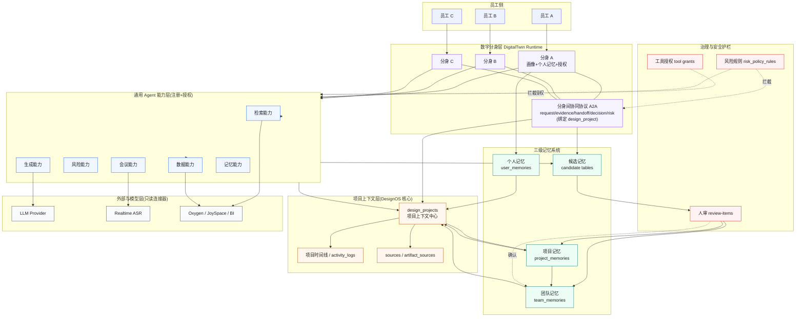
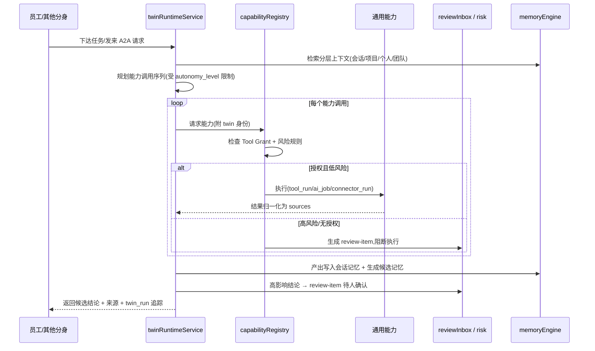

# DesignOS × AgentMesh 融合方案:员工数字分身与自主协同工作台

> 日期:2026-07-10
> 落地主干:DesignOS(Node.js / Express / TypeScript / PostgreSQL / React)
> 能力参考源:ai-agentmesh(Python / FastAPI / SQLite 原型)
> 核心架构:为每个员工配备一个**数字分身**;分身可调用系统提供的**通用 Agent 能力**;分身之间可**自主交流并协同**完成工作;系统提供**个人 / 项目 / 团队**三级记忆。
> 本方案分两部分:**愿景章**(为什么这么做、核心理念、顶层架构)与**工程章**(如何落到 DesignOS 的真实模块、数据模型与分阶段路线)。

---

## 摘要(一句话)

在 DesignOS 现有"以项目为中心的设计全周期工作台"之上,为每位员工构建一个绑定其画像与个人记忆的**数字分身(DigitalTwin)**;分身通过统一的**能力注册表**调用系统级通用 Agent(检索 / 数据 / 风险 / 会议 / 规范等),通过一套受治理的**分身间协同协议(A2A)**在项目上下文里自主交流、分派与交接工作;所有产出经**三级记忆(个人 / 项目 / 团队)**沉淀,并全程受"AI 非事实源、团队记忆需人审、外部连接器只读、可追溯可撤回"这套既有护栏约束。

---

# 第一部分 · 愿景章

## 1. 为什么做这次融合

### 1.1 两个项目各自的底牌

**DesignOS(主干)** 已经具备一套完整的设计全生命周期业务骨架与 AI Native 基础设施:

- 以 `design_projects` 为顶层容器的项目上下文中心,需求生命周期(12 态状态机)、会议 Copilot、群聊沉淀、竞品库、资产库、任务看板、关系图谱、仪表盘。
- 四层记忆引擎(会话 / 个人 / 项目 / 团队)+ 候选记忆治理 + 完整审计(`memory_events` / `memory_usage_logs`)。
- AI 编排层(clarify / analysis / full-cycle)、`tool_runs` / `ai_jobs` DB 落盘异步执行、`sources` + `artifact_sources` 来源追踪、`review-items` 只读人审聚合。
- **`person_profiles` 行为画像模块**——这是"数字分身"最关键的现成种子。
- 外部只读连接器(Oxygen / JoySpace / taobao / JD)、文档知识 keyword RAG。

**AgentMesh(参考源)** 是一个 chat-first 的团队 Agent 平台原型,它把"多 Agent 协同"这件事想清楚了:

- **个人 Agent**(每用户一个)+ **系统级公共 Agent**(`research_agent` / `data_agent` / `risk_agent`)。
- **Blackboard 黑板协同**:`request` / `evidence` / `risk` / `decision` / `handoff` / `archive` / `memory_candidate` 等帖子类型,加上 auto-post 队列——这是分身之间"自主交流与交接"的机制原型。
- 显式**工具授权**(ToolDefinition + Tool Grant,防止所有 Agent 默认拥有全部工具)。
- 风险审核四信号(prompt injection / high-risk tool / source policy / human approval)+ Inbox 人审。
- 三作用域记忆(个人 / 项目 / 团队)+ 候选提升治理,与 DesignOS 高度同构。

### 1.2 融合判断:演进,而非搬运

DesignOS 里已存在一份 `2026-06-19-AgentMesh能力迁入DesignOS方案`,其结论是"以 DesignOS 为主、只迁机制不搬实现、不引入重型 Agent 框架、工具靠用户显式触发"。那份方案解决的是**可追溯 / 可确认 / 可沉淀的底座**。

本方案是它的**下一步演进**:在同一批底座能力(Source / ReviewItem / DesignMemory / Risk / ToolGrant / Connector)之上,引入一个更主动的组织层——**数字分身**。三条演进主线:

1. **从"个人 Agent"到"数字分身"**:分身不只是一个聊天助手,而是绑定员工画像 + 个人记忆 + 授权工具集的、可代表员工在项目里持续工作的运行时实体。
2. **从"用户显式触发工具"到"分身受控自主"**:保留显式触发作为默认,但允许分身在明确边界内自主编排能力、发起协同——**自主性产出的一律是候选 / 提案,不是权威事实**。
3. **从"黑板帖子"到"分身间协同协议(A2A)"**:把 AgentMesh 的 blackboard 思想落到 DesignOS 现有的 `design_projects` + `activity_logs` + 会议语义事件上,不新建平行 BBS 主界面。

> 关键立场:数字分身带来的是**主动性**,不是**权威性**。DesignOS 的四条铁律——AI 输出不能单独作为事实源、团队记忆必须人工确认、外部连接器 V1 只读、一切引用可追溯可撤回——全部保留,并成为分身自主行为的护栏。

## 2. 核心架构理念

融合后的系统由四个相互咬合的层次构成。

### 2.1 数字分身(DigitalTwin)——每位员工的代表

每位员工拥有一个数字分身,它是一个**有身份、有记忆、有授权、有画像**的运行时实体:

- **身份**:绑定 `users`,继承其角色(admin / leader / designer / requester)与权限。
- **画像**:复用 `person_profile_snapshots` 的行为画像(擅长领域、协作风格、历史偏好),让分身"像这个人"。
- **记忆**:以个人记忆(`user_memories`)为长期人格,以会话记忆为短期工作上下文。
- **授权**:通过 Tool Grant 决定这个分身能调用哪些通用能力(与员工角色对齐)。

分身的职责边界很清晰:它**代表员工在项目上下文里理解任务、调用能力、与其他分身协同、产出候选结论**;它**不替员工做最终决定**,高影响动作一律回流到人审。

### 2.2 通用 Agent 能力层——系统提供、分身调用

系统提供一组**通用 Agent 能力**(可理解为"分身可雇佣的专家"),分身按需调用:

| 通用能力 | 职责 | DesignOS 承载 |
|---|---|---|
| 检索能力(Research) | 竞品 / 历史案例 / 用研 / 规范检索 | `researchToolAdapter` + Connector Registry |
| 数据能力(Data) | 上线指标 / AB / 评论 / BI | DataConnector + Oxygen `bdp-copilot` |
| 风险能力(Risk) | prompt 注入 / 来源策略 / 高危动作审查 | `riskReviewService`(新增) |
| 会议能力(Meeting) | 转写 / 语义抽取 / 建议 | 现有 `modules/meetings/` |
| 生成能力(Author) | 分析报告 / 全周期文档 / 策略 / 复盘 | 现有 AI capability 层 + Artifact Template |
| 记忆能力(Memory) | 三级记忆读写 / 候选 / 检索 | `memoryEngine` + `memoryRetriever` |

能力是**注册 + 授权**的:先在能力注册表登记,再显式授权给分身,分身执行前检查授权。这样能力可无限扩展而不失控。

### 2.3 分身间自主协同(A2A)——受治理的交流与交接

分身之间通过一套**协同协议**在项目上下文里自主交流:

- **协同发生在项目里**:所有 A2A 消息绑定 `design_project_id`,进入项目时间线,天然可追溯。
- **消息类型借鉴黑板**:请求(request)、证据(evidence)、交接(handoff)、决策提案(decision-proposal)、风险提示(risk)。
- **协同产物是候选**:分身协同得出的结论进入候选记忆 / review-item,由人确认后才成为项目 / 团队事实。
- **有护栏**:跨项目访问、批量外部调用、写团队记忆等高影响协同动作,自动触发风险审核并进人审。

典型协同:设计师分身在做竞品分析时,自主向"数据分身能力"请求上线指标,向"检索能力"请求历史案例,把两者证据交接给"生成能力"产出策略草案,最后把草案作为候选提交给设计师本人确认——全程留痕。

### 2.4 三级记忆——个人 / 项目 / 团队

系统提供三级记忆,分身既是消费者也是(受治理的)生产者:

- **员工自身维度(个人记忆)**:员工的偏好、工作习惯、擅长方法。构成分身"人格",跨项目跟随员工。对应 `user_memories`。
- **项目维度(项目记忆)**:某项目内共享的需求背景、决策、风险、会议结论。项目成员的分身共享读取。对应 `project_memories`。
- **团队维度(团队记忆)**:跨项目可复用的方法论、风险模式、设计经验。**必须经 leader/admin 人工确认**才能沉淀。对应 `team_memories`。

> 记忆的传递方向沿用 DesignOS 记忆分层治理方案:个人→项目仅在明确绑定项目时;个人/项目→团队必须走候选+确认;团队记忆参与检索但不复制回项目表。分身的自主抽取只影响会话短期记忆与"提出候选",不绕过任何确认。

## 3. 顶层架构图



## 4. 端到端故事(分身如何协同一个设计全周期)

以一个真实的设计需求为例,看四个分身如何协同,而人始终掌握确认权。

**设计前——需求进入。** 需求方员工把一份 PRD 上传到项目。需求方的分身识别出这是新需求,在项目上下文里发起一条 `request`:"需要竞品与历史案例支撑"。设计师的分身收到交接。

**设计前——自主取证。** 设计师分身调用**检索能力**拉竞品与历史案例,调用**数据能力**(经 Oxygen `bdp-copilot`)拉同类产品上线指标。所有外部资料先过**风险能力**做来源策略与 prompt 注入检查——命中可疑内容则不进入 LLM 合成,转人审。取证结果归一化为 `sources`。

**设计中——生成候选。** 设计师分身把证据交接给**生成能力**,产出一份带引用的设计策略草案。草案不是事实,而是一条**候选记忆** + 一条 `review-item`,推给设计师本人确认。设计师改两处后确认,草案沉淀为**项目记忆**。

**设计中——会议校准。** 评审会上,**会议能力**实时转写并抽取决策、风险、行动项。会议分身把"决策:采用方案 B"作为会议候选提交,leader 确认后进入项目记忆,并写入项目时间线。

**设计后——复盘与团队沉淀。** 项目上线后,数据分身拉回真实指标与舆情;设计师分身生成复盘草案。其中"某类首页改版的转化提升模式"被判定为跨项目可复用,提升为**团队候选**——但它必须由 leader/admin 人工确认,才能进入**团队记忆**,供未来所有项目的分身检索复用。

> 这个闭环里:分身**主动**驱动了取证、生成、协同、复盘;但每一个会改变组织事实的节点,都停在**人确认**这一步。这就是"主动而不越权"。

---

# 第二部分 · 工程章

本章把上面的理念落到 DesignOS 的真实模块、目录结构与数据模型上。原则沿用 `2026-06-19` 方案:**迁机制不搬实现**,DesignOS 保持单一技术栈(TS / Express / PostgreSQL / React)与单一事实源(PostgreSQL),不引入 LangGraph / CrewAI 等重型 Agent 框架,新长任务沿用 `tool_runs` / `ai_jobs` 的 `INSERT → setImmediate → write-back` 异步范式。

## 5. 落地主干与目录约定

DesignOS 现有约定不变:route 模块调用聚焦的 service 函数,service 拥有业务规则,超出单一 service 的特性做成 `modules/` 下的 domain/application/transport 三层模块(如 `meetings/`、`person-profiles/`)。

数字分身作为一个成规模的新特性,建议独立为一个模块:

```text
backend/src/modules/digital-twins/
  domain/         # 分身身份、能力调用意图、A2A 消息、协同状态(纯领域逻辑)
    twin.ts             # DigitalTwin 聚合:身份+画像引用+授权集
    a2aMessage.ts       # A2A 消息模型与状态机
    collaborationState.ts  # 协同会话状态(增量归约,参考 meetingState)
    capabilityIntent.ts # 能力调用意图与边界校验
  application/     # 编排:能力调用、协同分派、候选产出、护栏检查
    twinRuntimeService.ts     # 分身运行时:接收任务→规划→调用能力→产出候选
    capabilityRegistry.ts     # 通用能力注册+授权检查
    a2aBus.ts                 # 分身间消息投递(DB 落盘,非内存队列)
    collaborationService.ts   # 协同会话生命周期
  transport/      # Express 路由 + WebSocket(可选实时协同流)
    twinRoutes.ts
    a2aRoutes.ts
```

复用而非新建的既有能力:`person-profiles/`(画像)、`memoryEngine` / `memoryRetriever`(三级记忆)、`toolRegistry` / `researchToolAdapter` / `connectors`(能力)、`aiJobService` / `tool_runs`(异步)、`sources` / `artifact_sources`(溯源)、`reviewInboxService`(人审)、`activity_logs`(时间线)。

## 6. 数字分身运行时(DigitalTwin Runtime)

### 6.1 分身 = 身份 + 画像 + 记忆 + 授权

分身不是新造一个"用户",而是一个绑定既有 `users` 的运行时聚合:

- **身份/权限**:直接用 `users.role` 与现有中间件 `middleware/roles`,分身能做什么不超过员工本人的权限。
- **画像**:引用 `person_profile_snapshots`,把行为画像(擅长领域、协作风格、活跃项目)作为分身的 system persona 注入 prompt。
- **人格记忆**:检索 `user_memories`(个人偏好/习惯)作为长期人格。
- **工作记忆**:`chat_session_memories`(约 14 天 TTL)作为短期上下文,解决刷新后断裂。
- **授权**:通过 Tool Grant(见 §7.2)决定可调用的能力集。

### 6.2 数据模型

分身自身状态很轻,大部分依赖既有表。新增一张分身表 + 一张运行记录表:

```text
digital_twins                      -- 每员工一个分身(迁移 03x)
  id
  user_id            -- 唯一,绑定 users
  status             -- active / paused / disabled
  persona_summary    -- 由 person_profile 派生的可读人格摘要(缓存,可重算)
  profile_snapshot_id-- 引用 person_profile_snapshots,记录人格来源版本
  autonomy_level     -- manual / assisted / autonomous(见 §9 护栏)
  config             -- jsonb:默认能力偏好、协同开关等
  created_at
  updated_at

twin_runs                          -- 分身一次自主/受托执行的落盘记录(仿 tool_runs)
  id
  twin_id
  design_project_id
  trigger            -- user / a2a / schedule
  intent             -- 本次意图(自然语言 + 结构化)
  status             -- queued / running / completed / failed / needs_review
  capability_calls   -- jsonb[]:调用了哪些能力、各自 tool_run/ai_job/connector_run id
  outputs            -- jsonb:产出的候选/来源/提案 id 列表
  error
  created_by
  created_at
  updated_at
```

> `twin_runs` 与 `tool_runs` / `ai_jobs` 同构:分身运行本身也是"入库→后台执行→写回",可跨实例查询、重启存活。`autonomy_level` 是关键护栏字段:默认 `assisted`(分身可规划与调用只读能力,但产出一律候选);`autonomous` 仅在明确开启且受风险规则约束时允许自主发起协同与外部检索。

### 6.3 运行时执行流



## 7. 通用 Agent 能力层

### 7.1 能力注册表(Capability Registry)

沿用 AgentMesh"能力先由后端注册,再显式授权"的思想,落到 DesignOS 的 `toolRegistry` 之上,统一登记通用能力:

```text
ai_capabilities                    -- 通用能力定义(可由 toolRegistry 扩展承载)
  id
  name               -- research / data / risk / meeting / author / memory ...
  category
  provider           -- local / researchToolAdapter / connector / llm
  risk_level         -- low / medium / high
  autonomy_allowed   -- 该能力是否允许分身在 autonomous 下自主调用
  enabled
  metadata
  created_at
  updated_at
```

能力实现映射到既有服务:检索→`researchToolAdapter` + Connector Registry;数据→DataConnector + Oxygen;会议→`modules/meetings/`;生成→`services/ai.ts`(clarify/analysis/full-cycle)+ Artifact Template;记忆→`memoryEngine`。风险能力为新增小服务(见 §9)。

### 7.2 分身能力授权(Twin Capability Grant)

防止所有分身默认拥有全部能力,尤其是高危与外部写:

```text
twin_capability_grants
  id
  capability_id
  role               -- 按角色批量授权(designer/leader/...)
  twin_id            -- 或按单个分身精授权(可空)
  enabled
  granted_by
  created_at
  updated_at
```

执行前检查顺序:分身身份 → 角色/分身授权 → 能力 `autonomy_allowed` 与分身 `autonomy_level` → 风险规则。任一不过则阻断或转人审。

### 7.3 外部连接器:沿用只读边界

Oxygen / JoySpace 等连接器保持 `execFile` 只读桥接、脱敏 token、不回写源系统。分身经数据/检索能力间接使用连接器,结果一律归一化为 `sources` + records,并落 `connector_runs`。写操作(上传/编辑/删除/批量)一律进 review-item。

## 8. 分身间自主协同(A2A)

### 8.1 不新建 BBS,落到项目上下文

不照搬 AgentMesh 的 Blackboard 主界面(会与 DesignOS 的需求详情/看板/会议重复)。而是把黑板的**消息类型思想**落到 `design_projects` 上下文 + 一张 A2A 消息表 + 现有 `activity_logs` 时间线:

```text
a2a_messages
  id
  design_project_id  -- 协同必须绑定项目上下文,天然可追溯
  from_twin_id
  to_twin_id         -- 可空:广播给项目内相关分身
  msg_type           -- request / evidence / handoff / decision_proposal / risk / ack
  ref_type           -- 关联对象类型:requirement / meeting / source / candidate / twin_run
  ref_id
  payload            -- jsonb:结构化内容
  status             -- open / accepted / done / rejected / needs_review
  created_at
  updated_at
```

消息类型到既有模型的落点(沿用 06-19 方案的映射):

| A2A 消息 | 落到 DesignOS |
|---|---|
| evidence(证据) | `sources` / `artifact_sources` |
| risk(风险) | `risk_assessments` / review-item |
| decision_proposal(决策提案) | 候选记忆(`memory_type=decision`)+ review-item |
| handoff(交接) | `activity_logs` + review-item(如需人介入) |
| request/ack(请求/回执) | `a2a_messages` + 项目时间线 |

### 8.2 协同的落盘投递,而非内存队列

`a2aBus` 沿用 `ai_jobs` 的落盘异步范式:消息入 `a2a_messages`(`open`)→ `setImmediate` 投递给目标分身运行时 → 写回 `accepted/done`。可选一个默认关闭的后台 worker 处理广播与超时(仿 AgentMesh 的 auto-post drain worker,`enabled` 默认 false)。**绝不引入独立队列基础设施**。

### 8.3 协同会话状态

多分身围绕一个任务的协同,状态用增量归约维护(参考 `modules/meetings/domain/meetingState.ts`),不反复把全量历史塞给模型。协同产物统一走候选 + 人审。

## 9. 治理与安全护栏(自主性的边界)

自主性越强,护栏越关键。全部沿用并复用 DesignOS 既有机制,新增仅补齐 risk 落地。

### 9.1 风险审核

补齐 AgentMesh 的四类信号到 DesignOS(06-19 方案已规划,本方案复用):

```text
risk_policy_rules ( rule_id, category, signal, message, decision[allow/needs_review/block], enabled, ... )
risk_assessments  ( design_project_id, target_type, target_id, decision, findings, created_by, ... )
```

分身触发风险审核的时机:外部资料进入 LLM 合成前(prompt injection / source policy)、高危能力调用前(批量检索/下载/跨项目访问)、写团队记忆前、`autonomous` 分身发起外部检索前。命中 `needs_review`/`block` 即生成 review-item 或阻断。

### 9.2 人审:复用 review-items 只读 UNION

**不新建 `review_items` 实体表**。沿用 `reviewInboxService` 对候选表的只读 UNION,新增分身相关来源纳入 UNION:分身产出的决策提案候选、协同交接待办、风险命中项。每项携带 `actions.confirm/reject` 回指各自候选端点。可见性沿用现有规则(项目候选需项目管理角色,个人候选仅 `created_by`)。

### 9.3 三条不可逾越的红线(与既有原则一致)

1. **AI/分身产出不能单独作为事实源**:分身自主结论一律是候选,需人确认。
2. **团队记忆必须人工确认**:个人/项目→团队只能走 `team_memory_candidates` + leader/admin 确认。
3. **连接器 V1 只读**:分身的一切外部写(上传/编辑/删除/批量)必须进 review-item。

### 9.4 全程审计

分身的每次能力调用、A2A 消息、候选产出、确认/拒绝,写 `activity_logs` + `memory_events` / `memory_usage_logs`。`twin_runs` / `a2a_messages` 提供分身维度的可回放追踪。

## 10. 三级记忆的分身化落地

三级记忆表不变(`user_memories` / `project_memories` / `team_memories`),沿用 `2026-06-21` 分层治理方案的来源事件、候选、传递规则。融合带来的变化只有两点:

1. **分身成为记忆的读写主体**:检索时 `memoryRetriever` 按"会话短期→项目已确认决策/风险→个人偏好→团队规范→相关工具/会议结论"的分层顺序为分身组织上下文;写入时分身只能自动写会话记忆、按 `writePolicy=auto && confidence>=0.6` 写低风险个人偏好,其余走候选。
2. **记忆带分身溯源**:扩展记忆元数据 `source_kind` 增加 `twin`,`source_event_id` 关联 `twin_runs` / `a2a_messages`,让"这条记忆是哪个分身、在哪次协同里提出的"可回查。

> 员工自身维度 = `user_memories`(跟随员工跨项目);项目维度 = `project_memories`(项目成员分身共享);团队维度 = `team_memories`(跨项目复用,人审沉淀)。这与用户诉求的三级记忆一一对应。会话短期记忆是分身的"工作内存",不算正式层级。

## 11. 数据模型汇总(新增/复用)

**新增表**(全部走 `db:migrate` 增量迁移,新字段可空以兼容旧数据):

- `digital_twins`、`twin_runs`(§6.2)
- `ai_capabilities`、`twin_capability_grants`(§7)
- `a2a_messages`(§8.1)
- `risk_policy_rules`、`risk_assessments`(§9.1,若 06-19 已建则复用)
- 记忆元数据扩展字段 `source_kind` 增加 `twin` 枚举值(§10)

**直接复用表**:`users` / `person_profile_snapshots` / `user_memories` / `project_memories` / `team_memories` / 各 candidate 表 / `sources` / `artifact_sources` / `tool_runs` / `ai_jobs` / `activity_logs` / `memory_events` / `memory_usage_logs` / `design_projects`。

## 12. 分阶段落地路线

延续 06-19 方案的 Phase 0–5(Source / ReviewItem / DesignMemory / Risk / Connector / ToolGrant 底座)。本方案在底座之上追加数字分身四阶段:

**Phase A — 分身骨架(P0)**
- 建 `digital_twins`,员工创建即建分身(仿 AgentMesh"建用户即建个人 Agent")。
- 分身绑定画像 + 个人记忆,注入项目对话的 system persona。
- 验收:每员工有分身;对话中分身能体现个人偏好与画像。

**Phase B — 通用能力层 + 授权(P0)**
- 建 `ai_capabilities` + `twin_capability_grants`,把检索/数据/生成/记忆能力登记授权。
- 分身经能力注册表调用,执行前检查授权与风险。
- 验收:高危能力默认不对普通分身开放;admin 可启停能力;调用可审计。

**Phase C — 受控协同 A2A(P1)**
- 建 `a2a_messages` + `a2aBus`(落盘投递)+ 协同会话状态。
- 先支持"分身→分身请求/交接/证据"三类,产物走候选 + 人审。
- 验收:两个分身能围绕一个项目任务完成一次取证→交接→生成候选的闭环,全程留痕。

**Phase D — 自主性放开(P2,谨慎)**
- 引入 `autonomy_level`,默认 `assisted`;在风险规则齐备后,按能力 `autonomy_allowed` 灰度开放 `autonomous`。
- 可选后台 worker 处理广播/超时(默认关闭)。
- 验收:`autonomous` 分身的自主外部检索必过风险审核;任何高影响结论仍停在人确认。

> 最小可行闭环:`Phase A + B` 即可让"有画像有记忆的分身,受权调用通用能力产出带来源的候选"跑通。协同(C)与自主(D)在闭环稳定后再逐层放开。

## 13. 验收标准

- 每位员工有且仅有一个数字分身,绑定其画像与个人记忆,权限不超过本人。
- 分身调用任何能力前都检查授权与风险;高危能力默认不开放给普通分身。
- 分身间协同全部绑定 `design_project`,进项目时间线,可按 `twin_run` / `a2a_message` 回放。
- 分身自主产出一律为候选;团队记忆必须经 leader/admin 人工确认。
- 三级记忆(个人/项目/团队)分身可读,写入受 `writePolicy` 与候选治理约束。
- 外部资料含 prompt 注入内容不进入 LLM 合成;外部写操作一律进 review-item。
- 每条分身相关记忆可回查:来源、哪个分身、哪次协同、谁确认、是否被替代。

## 14. 与 DesignOS 既有原则的一致性对照

| DesignOS 铁律 | 本方案如何遵守 |
|---|---|
| AI 输出不能单独作为事实源 | 分身自主结论一律候选,需人确认(§9.3) |
| 团队记忆必须人工确认 | 个人/项目→团队走候选 + leader/admin 确认(§10) |
| 外部连接器 V1 只读 | 分身经只读连接器取证,写操作进 review-item(§7.3) |
| 不引入重型 Agent 框架 | 分身运行时是 TS service,无 LangGraph/CrewAI(§5) |
| 新长任务用 tool_runs/ai_jobs 范式 | `twin_runs` / `a2aBus` 同构落盘异步(§6.2/§8.2) |
| 不新建平行任务/BBS 系统 | 复用 review-items UNION,不建 BBS 主界面(§8.1/§9.2) |
| 单一事实源 = PostgreSQL | 所有分身/协同状态落 PostgreSQL,外部 memory 仅 adapter(§10) |
| 一切可追溯可撤回 | 全程 activity_logs + memory_events + twin_runs 审计(§9.4) |

## 15. 明确不做的事

- 不把 DesignOS 改造成 chat-first 命令行产品;分身能力以页面动作为主,slash 命令仅辅助。
- 不搬 AgentMesh 的 Python/FastAPI/SQLite 实现、单文件前端、完整 Blackboard 页面、独立 Workspace/Auth。
- 不引入独立消息队列/向量数据库基础设施;检索增强走 `memory_embeddings` / pgvector 内生路径。
- 不让分身在 `autonomy_level` 未开启时自主发起外部检索或写任何正式记忆。

