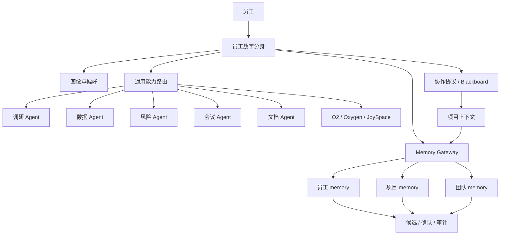
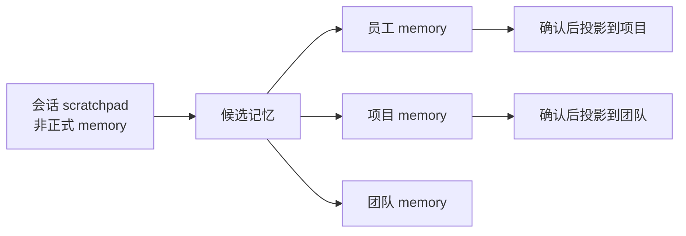

# 员工数字分身 × DesignOS × AgentMesh 融合方案

## 1. 结论先行

融合后的产品不应该做成“很多 Agent 自由聊天”的玩具，而应该是一个有权限、有记忆、有任务边界、有审计的组织协作系统。

核心架构建议：

- **每个员工一个数字分身**：数字分身代表员工处理信息、发起协作、调用工具、沉淀记忆，但不绕过员工授权。
- **通用 Agent 能力作为系统能力池**：调研、数据查询、风险审核、文档解析、会议总结、Oxygen/JoySpace/O2 等能力以工具/能力服务形式提供，不为每个员工复制一套实现。
- **数字分身之间通过任务协作协议交流**：交流不是无约束闲聊，而是围绕项目、任务、交付物、证据、阻塞点和交接包进行。
- **三级正式 memory**：员工自身维度、项目维度、团队维度。会话记忆只作为运行时 scratchpad，不进入正式 memory 层级。
- **DesignOS 做业务与数据主系统，AgentMesh 提供个人 Agent、黑板协作和权限治理内核**：不要引入 LangGraph/CrewAI 之类重框架，也不要再造一个独立知识库。

一句话：这是一个“员工数字分身协作网络”，不是一个“Agent 群聊大厅”。

## 2. 两个项目现有能力盘点

### 2.1 DesignOS 可复用能力

DesignOS 已经具备设计组织智能工作台的主体骨架：

- **项目上下文中枢**：`DesignProject` 是顶层容器，需求、会议、群聊、上传文件、工具结果、阶段总结都沉淀到项目上下文。
- **设计生命周期业务模块**：需求流转、会议 Copilot、用研/竞品工具、资产/案例、项目作战室等模块能提供真实业务场景。
- **Memory Engine**：已有 session / personal / project / team 四层设计，以及候选记忆、人审确认、事件审计、引用日志等治理规则。
- **工具运行记录**：`tool_runs` 是 DB-backed 异步执行记录，适合承载长任务和外部工具结果回流。
- **外部连接器**：Oxygen、JoySpace、外部知识同步、文档知识索引等已经形成读-only 连接器模式。
- **人员画像模块**：person profiles 可以作为员工数字分身的基础画像输入，但不能直接等同于分身本体。

DesignOS 的强项是业务场景、项目上下文、团队知识沉淀和前端工作台。

### 2.2 AgentMesh 可复用能力

AgentMesh 已经具备数字分身协作雏形：

- **用户与个人 Agent 绑定**：`User.personal_agent_id` 已表达“员工有个人 Agent”的基础关系。
- **Agent 能力与工具授权**：`ToolDefinition`、`AgentToolGrant` 支持系统工具注册、Agent 级授权和风险分级。
- **任务与黑板协作**：`Task`、`BlackboardPost`、执行锁、handoff packet、阅读状态、自动发帖队列形成了协作协议雏形。
- **个人/项目/团队记忆雏形**：`UserMemoryItem` 和 `MemoryItem` 已覆盖私人记忆、项目记忆、团队候选/接受状态。
- **权限与审计**：角色策略、权限检查、audit event 已能支撑最小可用治理。
- **O2 能力验证经验**：对内部 CLI 的真实调用方式、鉴权边界和 smoke 流程已有沉淀。

AgentMesh 的强项是个人 Agent 编排、黑板式协作、权限边界、轻量服务 Agent 和最小可运行原型。

## 3. 目标产品形态

### 3.1 用户视角

每位员工拥有一个数字分身。员工可以让分身：

- 记住自己的工作偏好、项目背景、常用表达、关注风险和历史决策。
- 在项目中代表自己整理资料、提出问题、发起调研、找其他人的分身协作。
- 调用系统通用能力，例如用研、竞品、数据查询、会议总结、文档解析、风险审核。
- 在员工确认后，把有价值的信息沉淀为个人、项目或团队记忆。

项目成员的数字分身可以彼此协作：

- 设计师分身向产品经理分身确认需求背景。
- 项目负责人分身向研究员分身请求用户洞察。
- 风险审核分身检查外部素材、数据来源和发布风险。
- 多个分身围绕一个项目任务形成可追溯协作链路。

### 3.2 系统视角

系统由五个核心层组成：

## 4. 核心架构

### 4.1 员工数字分身层

数字分身是员工在系统里的代理，不是独立法人，也不是不受控机器人。

建议实体：`EmployeeTwin`。

关键字段：

- `id`
- `employee_id`
- `workspace_id`
- `default_project_id`
- `display_name`
- `status`
- `model_id`
- `persona_profile_id`
- `tool_policy_id`
- `created_at`
- `updated_at`

职责边界：

- 读取员工可见的个人、项目、团队上下文。
- 基于员工授权调用工具。
- 向其他数字分身发起结构化协作请求。
- 生成候选记忆，但不直接写入项目/团队正式记忆。
- 对高风险动作请求员工确认。

反模式：

- 不允许分身默认读取员工所有私人活动。
- 不允许分身绕过员工身份做写操作。
- 不允许分身把 AI 总结直接写成团队真相。
- 不允许分身之间无限自触发，必须有任务边界和停止条件。

### 4.2 通用 Agent 能力池

系统通用能力不绑定具体员工，而是作为可授权工具或服务 Agent 暴露。

建议能力分类：

- **Memory**：记忆检索、候选记忆生成、记忆冲突检测、引用记录。
- **Research**：竞品、用研、趋势、公开资料、内部资料检索。
- **Data**：业务数据查询、指标解释、报表摘要。
- **Document**：上传解析、文档问答、知识索引、版本差异总结。
- **Meeting**：实时转写、会议纪要、行动项、决策提取。
- **Risk**：版权、合规、外部引用、敏感信息、高风险动作审核。
- **O2 / Oxygen / JoySpace**：内部工具只读连接器。

调用原则：

- 能力通过 `ToolDefinition` / tool registry 注册。
- 授权通过员工角色、项目角色、Agent grant 和工具风险等级共同决定。
- 长任务必须写 `tool_runs` 或等价任务记录。
- 外部连接器默认只读，结果回流到项目 source，再进入候选记忆。

### 4.3 数字分身协作协议

数字分身之间的交流必须结构化，避免“两个 LLM 互相废话”。

建议沿用并强化 AgentMesh 的 blackboard 模式：

- `Task`：协作的唯一工作单元。
- `BlackboardPost`：协作消息，类型包括 request、evidence、risk、decision、handoff、memory_candidate、correction。
- `ExecutionLock`：同一时刻谁负责推进任务。
- `StructuredHandoffPacket`：交接目标、当前结果、完成标准、下个 owner、阻塞点。
- `read_by_agents`：追踪哪些分身已读取。
- `done_when`：停止条件，防止无限循环。

最小协作协议：

1. 发起方分身创建任务，写清目标、背景、完成标准。
2. 接收方分身只在自己权限和能力范围内响应。
3. 工具调用结果必须作为 evidence，并带来源。
4. 决策必须显式标为 decision，并记录决策人或确认人。
5. 需要他人继续时使用 handoff，不靠自然语言暗示。
6. 任务完成后生成 digest，并进入候选记忆流程。

### 4.4 三级 memory

用户要求的正式 memory 采用三级，不把 session 算作正式层级：

#### 员工 memory

范围：员工自己的偏好、经验、工作习惯、历史项目角色、常用判断标准、私人备注。

写入规则：

- 私人聊天中的低风险抽取可以自动进入候选或低风险个人记忆。
- 与项目相关但包含个人偏好的内容默认只归员工本人。
- 任何向项目或团队投影的内容必须让员工知道。

#### 项目 memory

范围：项目事实、需求变更、关键决策、会议结论、工具结果、风险判断、阶段产出。

写入规则：

- 来源必须是项目内可审计 source：会议、文档、任务、工具运行、黑板决策。
- 默认先进入候选记忆。
- 项目负责人或有权限成员确认后才成为 active 项目记忆。

#### 团队 memory

范围：跨项目可复用的方法论、风险模式、设计原则、组件经验、流程经验。

写入规则：

- 团队 memory 不直接从聊天生成。
- 只能从已确认的员工或项目 memory 投影生成。
- 必须有人审确认，保留来源链路和适用范围。

### 4.5 Memory Gateway

Memory Gateway 是数字分身读取和写入记忆的唯一入口。

职责：

- 根据员工、项目、团队、角色和任务上下文检索 memory。
- 记录 memory usage log，说明谁在什么上下文引用了哪条记忆。
- 接收候选记忆，进入 review inbox。
- 管理投影关系：员工 → 项目、项目 → 团队。
- 做冲突检测、过期、废弃和修正。

不要让业务模块直接写正式 memory。所有写入都走 candidate → confirm/reject → active 的路径。

## 5. 与 DesignOS 的融合方式

### 5.1 主系统选择

建议：**DesignOS 作为主系统，AgentMesh 的核心机制迁入或服务化接入 DesignOS**。

理由很简单：

- DesignOS 已有项目生命周期、PostgreSQL、前端工作台和真实设计业务模块。
- AgentMesh 目前是 FastAPI 原型，适合验证个人 Agent、黑板协作和权限模型。
- 让两个系统长期双写会制造数据一致性灾难，不值得。

短期可以让 AgentMesh 作为独立编排服务验证；中期必须收敛到 DesignOS 的 PostgreSQL 和项目上下文。

### 5.2 能力映射

| 目标能力 | DesignOS 现有基础 | AgentMesh 现有基础 | 融合建议 |
| --- | --- | --- | --- |
| 员工数字分身 | person profiles、用户体系 | `User.personal_agent_id`、`Agent.owner_user_id` | 建立 `EmployeeTwin`，绑定员工、画像、工具策略 |
| 项目上下文 | `DesignProject`、sources、tool runs | workspace/project、chat thread | 以 DesignOS project 为唯一项目容器 |
| 分身协作 | 项目作战室、activity timeline | `Task`、`BlackboardPost`、handoff | 引入 blackboard 协作协议到项目作战室 |
| 通用工具 | research tools、Oxygen、JoySpace、meeting、docs | `ToolDefinition`、`AgentToolGrant`、O2 | 统一 tool registry 和授权策略 |
| 员工 memory | personal memory、profiles | `UserMemoryItem` | 保留 personal memory，补强员工授权与投影 |
| 项目 memory | project memories、candidates | `MemoryItem(scope=project)` | DesignOS 为事实源，AgentMesh 经验补协议 |
| 团队 memory | team memories、team candidates | team_candidate/team_accepted | 团队 memory 只从确认记忆投影 |
| 审计治理 | memory events、usage logs | audit event、permission rules | 统一审计事件模型 |

## 6. 关键业务流程

### 6.1 员工日常对话

1. 员工向自己的数字分身提问。
2. 分身通过 Memory Gateway 读取员工 memory、当前项目 memory、可见团队 memory。
3. 分身回答，并标注引用来源。
4. 如果产生可沉淀信息，写入候选记忆。
5. 员工确认后进入员工 memory 或项目 memory。

### 6.2 分身发起跨人协作

1. 员工 A 的分身创建项目任务。
2. 系统根据项目角色和能力找到员工 B 的分身或通用能力 Agent。
3. A 分身发布 request，明确目标、上下文、完成标准。
4. B 分身读取自己可见上下文，必要时调用工具。
5. B 分身发布 evidence / decision / handoff。
6. A 分身汇总结果，交给员工 A 确认。
7. 结果进入项目 source 和候选项目 memory。

### 6.3 通用能力调用

1. 分身请求调用工具。
2. Capability Router 检查工具风险、员工角色、项目权限和 Agent grant。
3. 低风险工具可直接执行；中高风险工具进入确认。
4. 执行过程写 `tool_runs` 和 activity timeline。
5. 工具结果作为 source 回流项目上下文。
6. 高价值结论进入候选 memory。

### 6.4 团队经验沉淀

1. 项目结束或阶段复盘时，系统从 active 项目 memory 中提取可复用经验。
2. 生成团队 memory candidate。
3. 团队负责人确认、编辑适用范围和反例。
4. 写入 active 团队 memory。
5. 后续项目检索时带来源项目和适用条件，不把经验当绝对规则。

## 7. 数据模型建议

只加必要实体，别为了“Agent 平台感”建一堆空表。

### 7.1 必需实体

- `employee_twins`：员工数字分身。
- `twin_tool_grants`：分身可用工具授权，可复用现有 Agent grant 思路。
- `collaboration_tasks`：项目协作任务，可映射 AgentMesh `Task`。
- `collaboration_posts`：结构化协作消息，可映射 AgentMesh `BlackboardPost`。
- `memory_candidates`：统一候选记忆入口，或保持现有候选表但通过 review inbox UNION 暴露。
- `memory_relations`：员工/项目/团队 memory 之间的投影和引用关系。
- `memory_usage_logs`：检索引用审计。

### 7.2 不建议新增

- 不新增独立 vector database。关键词检索不够时再接 `memory_embeddings`，保留关键词 fallback。
- 不新增独立 review_items 表。review inbox 应该是候选表的只读 UNION。
- 不新增复杂 ABAC 引擎。先用角色、项目成员、工具风险、显式 grant。
- 不新增通用 Agent 搭建器。当前重点是员工分身和系统能力，不是开放搭积木。

## 8. 权限与安全边界

必须默认保守：

- 员工分身只能读取员工本人有权读取的数据。
- 私人 memory 默认不进项目，不被其他分身读取。
- 项目 memory 只对项目成员可见。
- 团队 memory 只存放可跨项目复用且已确认的抽象经验。
- 外部工具默认只读，写回外部系统必须单独审批，V1 不做。
- 分身代表员工发出的高风险行为必须留确认记录。
- 所有 memory 引用、候选、确认、拒绝、归档、投影都必须审计。

风险分级建议：

- **低风险**：检索、摘要、个人草稿、只读资料查询。
- **中风险**：项目可见内容发布、候选项目记忆、外部资料引用。
- **高风险**：团队记忆沉淀、跨项目引用敏感信息、对外发布、外部系统写操作。

## 9. UI 信息架构

建议在 DesignOS 项目作战室中新增或强化以下区域：

- **我的分身**：员工查看分身画像、可用工具、近期记忆、待确认事项。
- **项目分身协作链路**：展示谁的分身在为哪个任务协作，当前 owner、阻塞点、证据、决策。
- **项目 Memory Inbox**：项目候选记忆确认/拒绝/编辑。
- **团队经验候选**：从项目复盘中投影出来的团队 memory candidate。
- **工具运行记录**：展示工具调用状态、输入上下文、输出来源和是否已沉淀。

不要把 blackboard 直接暴露成主要人机界面。用户需要看到的是“任务进展和协作证据”，不是底层消息流。

## 10. 实施路线

### M1：数字分身最小闭环

目标：每个员工有可见、可控、可审计的分身。

- 建立员工与数字分身绑定。
- 分身能读取员工 memory、当前项目 memory、团队 memory。
- 分身能调用低风险通用工具。
- 分身输出可生成候选员工 memory。
- UI 提供“我的分身”和待确认 memory。

验收：员工能让自己的分身完成一次项目问答，并确认一条个人记忆。

### M2：项目内分身协作

目标：多个员工分身围绕项目任务协作。

- 引入结构化 collaboration task/post。
- 支持 request/evidence/decision/handoff/digest。
- 支持执行锁和当前 owner。
- 支持项目作战室展示协作链路。
- 协作结论进入项目 memory candidate。

验收：两个员工分身围绕一个设计需求完成一次信息确认和交接，产出项目候选记忆。

### M3：通用能力池接入

目标：分身能稳定调用系统通用 Agent 能力。

- 统一 tool registry。
- 接入 research、document、meeting、risk、O2/Oxygen/JoySpace。
- 长任务写 tool runs。
- 工具结果回流 project sources。
- 中高风险工具增加确认。

验收：分身调用真实内部工具完成一次调研，结果进入项目 source，并可被项目 memory 引用。

### M4：团队 memory 投影

目标：项目经验能变成团队经验。

- 从 active 项目 memory 生成 team memory candidate。
- 支持团队负责人确认、编辑适用范围。
- 建立 memory relation 和 usage log。
- 在新项目中检索团队 memory 时展示来源和适用条件。

验收：一个历史项目经验被确认成团队 memory，并在另一个项目中被引用。

### M5：治理与可观测性

目标：系统可试用、可追责、可优化。

- 完善权限策略和高风险审批。
- 建立关键指标：memory 接受率、引用覆盖率、工具成功率、协作完成时长、人工纠正率。
- 增加审计查询和异常告警。
- 做 3–5 人真实项目试点。

验收：真实试点中能完整追踪“员工请求 → 分身协作 → 工具调用 → 记忆沉淀 → 后续引用”。

## 11. 主要风险

### 11.1 自主协作失控

风险：分身互相调用，成本和噪声失控。

控制：任务必须有 owner、done_when、最大轮次、最大工具调用次数和人工接管条件。

### 11.2 个人隐私泄漏到项目/团队

风险：私人偏好或未公开信息被投影到项目/团队。

控制：个人 memory 默认私有，投影必须显式确认，并记录来源员工。

### 11.3 AI 生成内容污染组织知识

风险：模型幻觉被写成团队经验。

控制：AI 输出只能进候选；项目/团队 active memory 必须有人审和来源链路。

### 11.4 双系统长期并存

风险：DesignOS 和 AgentMesh 各有一套用户、项目、记忆和工具记录。

控制：短期服务化验证，中期 DesignOS PostgreSQL 做唯一事实源。

### 11.5 工具接入不稳定

风险：O2/Oxygen/JoySpace 依赖本机 CLI 登录状态和环境。

控制：启动前 doctor 检查；工具结果必须记录失败原因；真实宿主机 smoke 是上线门槛。

## 12. 明确不做

V1 不做以下事情：

- 不做自由放养的 Agent 群聊。
- 不做自动读取所有员工私域数据。
- 不做自动团队 memory 接受。
- 不做外部系统写回。
- 不做复杂 Agent 编排框架。
- 不做独立向量数据库。
- 不做面向用户的公共 Agent 搭建器。

## 13. 最小可行验收场景

推荐用一个真实设计项目做端到端验收：

1. 设计师员工 A 创建项目问题：“这次改版的核心用户痛点是什么？”
2. A 的数字分身读取项目资料和员工偏好，发现缺少用研证据。
3. A 分身向研究员员工 B 的分身发起协作 request。
4. B 分身调用用研/内部资料工具，返回 evidence 和来源。
5. A 分身汇总成项目结论，交给 A 确认。
6. 确认后写入项目 memory。
7. 项目复盘时，该经验被投影为团队 memory candidate。
8. 团队负责人确认后，后续类似项目可检索引用。

如果这个链路跑不通，就不要继续扩展更复杂的 Agent 能力。

