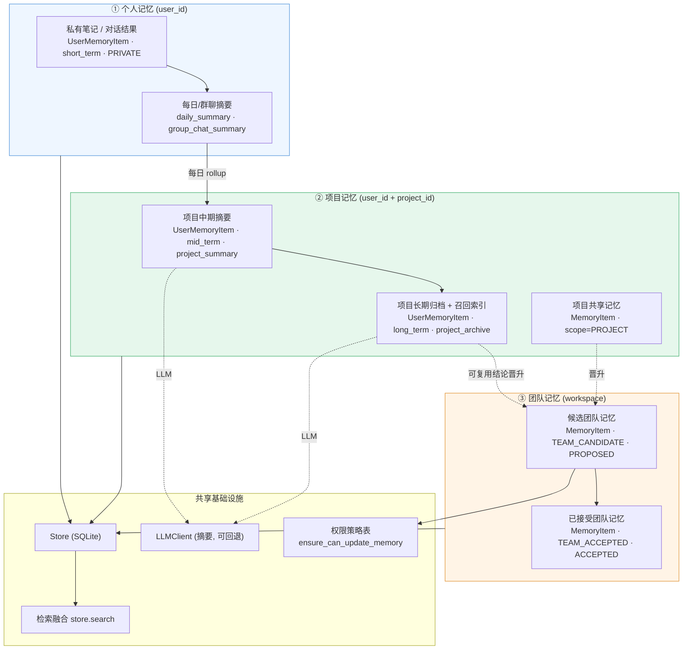
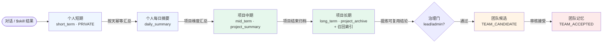
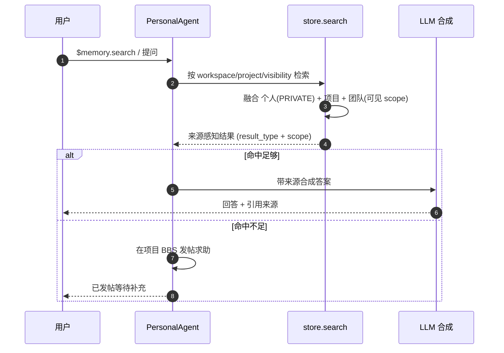
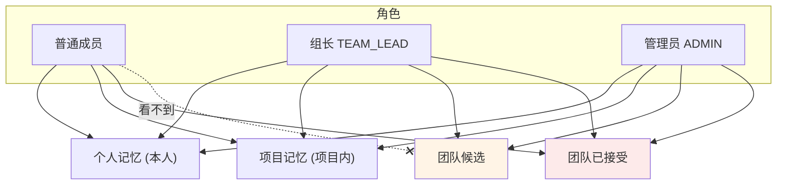
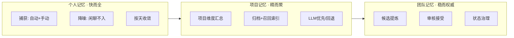
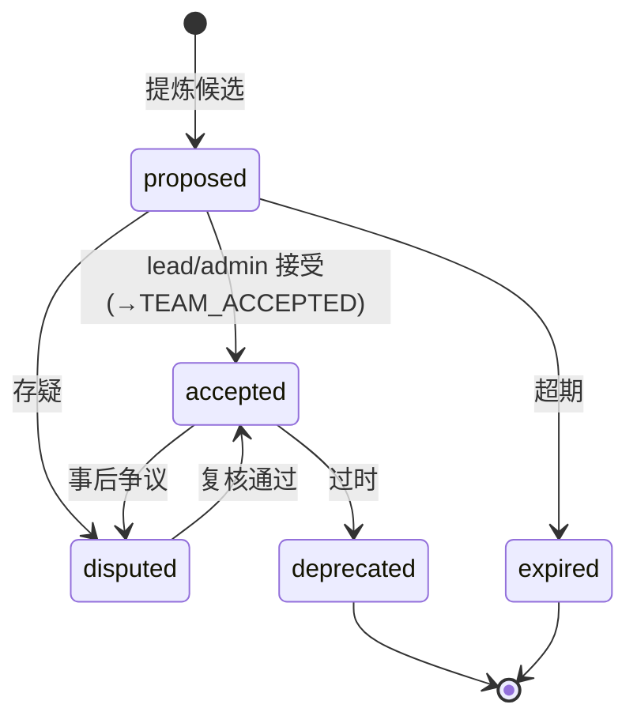

# AgentMesh 三层记忆设计（个人 / 项目 / 团队）

> 本文以"意图设计"视角，把 AgentMesh 的记忆体系拆解为**个人记忆 · 项目记忆 · 团队记忆**三层，给出：
> 一、架构设计；二、信息流转设计；三、功能设计。并在末尾诚实标注当前实现与意图之间的张力。
>
> 代码锚点：`agentmesh/models.py`、`agentmesh/routes/memory.py`、`agentmesh/agents.py`、`agentmesh/store.py`、`agentmesh/seed.py`。

---

# 一、架构设计

## 1.1 三层定义

三层的划分标准是**共享与治理级别**（谁拥有、谁能看、如何晋升），而不是时间。时间分层(short/mid/long)是"个人/项目"层内部的子结构。

| 维度 | 个人记忆 | 项目记忆 | 团队记忆 |
|---|---|---|---|
| **目的** | 个人工作上下文、私有笔记、对话结果 | 围绕某项目的阶段沉淀与共享结论 | 可复用、经审核的团队级知识资产 |
| **拥有者** | 单个用户 | 项目参与者 | 工作区/团队 |
| **隔离键** | `user_id` | `user_id + project_id`（个人视角）/ `project_id`（共享视角） | `workspace_id` |
| **底层模型** | `UserMemoryItem` | `UserMemoryItem`(mid/long) + `MemoryItem`(scope=PROJECT) | `MemoryItem`(scope=TEAM_*) |
| **可见性 Scope** | `PRIVATE` | `PRIVATE`(个人项目沉淀) / `PROJECT`(共享) | `TEAM_CANDIDATE` → `TEAM_ACCEPTED` |
| **时间分层 Layer** | `short_term` 为主 | `mid_term` / `long_term` | 不分层（以状态治理） |
| **写入方式** | 自动（workflow 结果）+ 手动笔记 | 汇总生成 + 手动晋升 | 候选提炼 → 审核接受 |
| **治理门** | 无（本人可写） | 弱（本人/项目内） | 强（`lead/admin` + 权限策略表） |
| **典型 memory_type** | `note` `data` `method` `chat_workflow:*` | `project_summary` `project_archive` | `decision` `brief_decision` `risk` `bbs_evidence` |

## 1.2 架构图（组件与归属）

---

# 二、信息流转设计

## 2.1 向上沉淀（越高越精、越共享）

信息从"个人即时"逐级浓缩、逐级升高共享级别；每次跨层都是**收敛 + 提权**，且高层跨越需要治理确认。

**关键流转规则**
- 普通闲聊 / `ASK_SYSTEM_INFO` / 待审批 **不进入**个人记忆（防污染）。
- 每级 rollup 排除上一轮自身产物（`daily_summary` / `short_term_rollup` / `project_archive`），防自我循环汇总。
- 归档强制含"召回索引"关键词段，供跨项目检索。
- 个人 → 团队的跨越**必须过权限门**（`ensure_can_update_memory` + 权限策略表），绝不自动写团队记忆。

## 2.2 向下召回（记忆如何反哺对话）

## 2.3 三层可见性矩阵（谁能看到哪层）

- 个人记忆：仅本人（`user_id` 隔离 + `PRIVATE`）。
- 团队候选：仅 `lead/admin` 可见（`_visible_memory_items` 过滤）。
- 团队已接受：全员可见（工作区内）。
- 跨工作区：仅 `ADMIN` 可越界。

---

# 三、功能设计

## 3.1 分层功能清单

| 层 | 功能 | API / 触发 | 代码位置 |
|---|---|---|---|
| 个人 | 自动写短期记忆 | workflow 结束自动 | `agents.py:_record_short_term_memory` |
| 个人 | 手动写记忆/笔记 | `POST /api/memory/user` | `routes/memory.py:139` |
| 个人 | 每日汇总（幂等） | `POST /user/daily-summary` | `routes/memory.py:155` |
| 个人 | 群聊摘要 | `POST /user/group-summary` | `routes/memory.py:168` |
| 个人 | 每日汇总 Worker（默认关） | 后台 · env-gated | `routes/memory.py:315` |
| 项目 | 中期摘要（LLM优先） | `POST /user/project-summary` | `routes/memory.py:190` |
| 项目 | 长期归档 + 召回索引 | `POST /user/archive-project` | `routes/memory.py:216` |
| 项目 | 分层视图/计数 | `GET /user`、`GET /overview` | `routes/memory.py:88,99` |
| 团队 | 创建候选团队记忆 | `$memory.propose` / BBS 晋升 / 文档确认 | `agents.py`、`blackboard.py:416`、`inbox.py:108` |
| 团队 | 接受候选（提权） | `PATCH /api/memory/{id}` status=ACCEPTED | `routes/memory.py:242` |
| 团队 | 权限门校验 | 内嵌于接受流程 | `permissions.py:ensure_can_update_memory` |
| 全层 | 检索融合 | `GET /api/search?visibility=...` | `store.py:search` |

## 3.2 各层功能职责（单一职责）

## 3.3 记忆状态治理（团队层）

---

# 四、实现张力（诚实标注，供后续收敛）

三层是清晰的**意图**，但当前实现有三处偏差，建议后续对齐：

1. **"项目记忆"身份分裂**：项目层同时由两种东西承担——`UserMemoryItem(mid/long, PRIVATE)` 是"个人的项目沉淀"（仍私有），而 `MemoryItem(scope=PROJECT)` 才是"项目共享记忆"。两者未打通，`seed.py:326` 有"项目记忆"示例但缺少从个人项目沉淀 → 项目共享的自动/半自动通道。
2. **向上流转半自动**：个人→每日→中期→归档→团队 这条链，除每日 Worker（默认关）外，中期/归档/候选大多需**显式 API 触发**，"记忆自动越沉越精"目前更多是接口就绪而非常驻运行。
3. **向下召回偏弱**：检索能融合三层，但"召回结果如何结构化注入下一轮 LLM 合成、并影响答案质量"这一闭环较薄，缺少可度量的召回命中率/引用覆盖率反馈。

> 建议收敛方向：把"项目共享记忆"确立为项目层唯一权威载体（个人项目沉淀作为其来源候选）；把 rollup 管线在真实环境常驻并幂等运行；把召回作为一等公民接入 chat 合成并度量。

---

## 图例

| 色 | 层 |
|---|---|
| 蓝 | 个人记忆 |
| 绿 | 项目记忆 |
| 橙 | 团队候选 |
| 红 | 团队已接受 / 高治理 |
