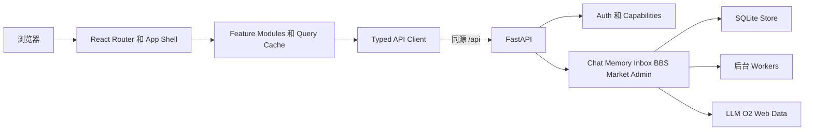

# AgentMesh React 前端完整替换设计

- 日期：2026-08-11
- 状态：已批准
- 范围：`agentmesh-demo`、FastAPI 前端契约、完整旧界面替换

## 结论

AgentMesh 采用两阶段迁移。第一阶段把当前 FastAPI 已实现的全部用户端和管理端能力接入 React，并在等价验证后退役根目录 `app.html`。第二阶段再把新界面中的演示能力变成真实后端能力，包括委托代答审批与采纳、项目复盘、数字人理解修正、影响力汇总和用户偏好。

迁移期间保留旧入口作为回滚面，但不把旧页面嵌入 React，也不复制旧页面中的权限判断、技能 fallback、工作流推断或本地假成功逻辑。FastAPI 继续负责权限、可见性、状态转换、风险判断和持久化，React 只负责展示、命令提交和服务端状态编排。

## 当前事实

后端是单进程 FastAPI、SQLite Store 和进程内 worker 的组合。`agentmesh/app.py:63-103` 注册认证、用户、聊天、Agent、Blackboard、记忆、Inbox、市场、文档、数据源、风险、Workspace 和健康检查路由。聊天及任务编排集中在 `agentmesh/agents.py`，持久状态经 `agentmesh/store.py` 写入 SQLite。

本次研究实际运行了完整后端测试，结果为 279 passed。新前端也完成生产构建。现有后端契约可以作为迁移基线。

`agentmesh-demo` 目前有 5 个 React 路由，见 `agentmesh-demo/src/App.tsx:9-21`。它没有 API client 或服务端状态层，数据来自 `agentmesh-demo/src/data/mockData.ts`，跨页业务变化由 `agentmesh-demo/src/store/DemoContext.tsx:86-206` 模拟。知识共享、协作授权、复用次数和影响力都只是内存计数，刷新即丢。

旧 `app.html` 覆盖登录、聊天、Inbox、分层记忆、Agent、工具、模型、任务、BBS、市场、协作图、审计、成员、风险、O2 和文档操作。它是功能迁移清单，不是可复用实现。旧页面中的硬编码账号、静态演示会话、前端技能 fallback、角色判断、DOM-only 消息和未检查 HTTP 状态的成功提示不进入新代码。

新前端的桌面视觉方向可保留，但响应式尚未成立。390px 视口下，固定侧栏占 260px，Workspace 主区只剩 130px。移动导航、窄屏详情面板和 Tab 溢出处理属于第一阶段验收范围。

## 目标

第一阶段完成后：

- React 覆盖旧界面的全部有效用户端和管理端功能。
- 根路径加载 React，`app.html` 已删除。
- 自然聊天保持私有，显式 `$` 技能仍由后端路由。
- Brief、注入隔离和团队记忆接受继续使用不同的专用确认动作。
- 用户、角色、Workspace、Project 和对象权限全部由 FastAPI 判定。
- 文档同步上传与异步解析、LLM fallback、worker disabled 和 provider degraded 状态均能准确展示。
- 390px、768px 和 1512px 视口都可操作。

第二阶段完成后：

- 新界面中的委托代答审批、授权、撤销、答案接收和采纳有稳定资源 ID 和持久记录。
- Insights 生成的知识候选与 Knowledge 展示的是同一资源。
- 数字人理解修正、影响力和偏好来自服务端，不再由前端递增计数。

## 非目标

本设计不同时推进 PostgreSQL、向量搜索、SSE、WebSocket、DesignOS、会议音频、贡献兑换、反合谋、跨 Workspace federation 或插件市场。

“只出答案”是内部协作和审计模式，不是隐私或知识产权保证。前端不得把逐字 guard 描述为语义泄漏防护。

## 方案选择

一次性替换会把认证、权限、确认闸门和管理端遗漏集中到同一次发布，回滚面过大。把旧页面嵌入 React 会长期保留双状态和双权限逻辑。采用双入口过渡和垂直切片迁移后，每个切片都能独立使用，旧入口只承担临时回滚职责，最终仍收敛到一个前端。

## 目标架构



### 前端模块

```text
agentmesh-demo/src/
  app/                 路由、Provider、全局错误边界
  api/
    client.ts          Cookie、错误和取消请求的唯一 HTTP seam
    generated/         FastAPI OpenAPI 生成类型
  features/
    auth/
    digital-self/
    workspace/
    insights/
    knowledge/
    collaboration/
    admin/
  components/ui/       纯视觉组件
  state/ui/            Toast、Drawer、当前 Tab 等临时状态
```

使用 `openapi-typescript` 从 FastAPI OpenAPI 生成 DTO。`client.ts` 统一处理相对 `/api`、FastAPI `detail`、422 字段错误、AbortSignal 和会话失效。业务端点按 feature 拆成薄函数，不做假定所有响应都有 `items` 的泛化解码，因为当前接口同时存在裸对象、`item`、`items`、复合响应和上传 union。

使用 TanStack Query 管理服务端状态。查询键包含当前用户、Workspace、Project 和筛选条件。退出或切换用户时清空缓存。治理、权限和协作类 mutation 不做业务状态的乐观更新，成功后的状态以服务端响应为准。

`DemoContext` 删除知识共享、授权、计数和理解状态等业务职责。Toast 和 Drawer 状态可保留在独立 UI Provider 中。

### 后端职责

FastAPI 继续负责：

- 当前用户和对象权限
- Blackboard、Inbox、记忆和文档可见性
- 聊天 intent、`$` 技能和 workflow 选择
- 风险规则、敏感度和确认闸门
- 任务 owner、lock、handoff 和状态转换
- 团队记忆晋升
- 市场参与、匹配和委托代答
- 审计、来源、贡献和血缘

React 不读取 SQLite，不调用内部 Agent 方法，也不根据 role 字符串重演 `permissions.py`。

## 信息架构

### 我的数字人

第一阶段显示当前用户、个人 Agent、工作空间、记忆统计、今日活动和市场参与。所有数字来自 bootstrap、Agent、activity、memory 和 market 接口。后端尚无契约的“最近理解了我”和影响力明细在第一阶段不显示交互按钮。

第二阶段接入数字人理解修正、贡献汇总、复用和偏好。

### AI 工作台

Workspace 负责会话、消息、技能、来源、workflow trace、Brief、文档和搜索。自然聊天与显式技能统一提交到 `POST /api/chat/messages`。前端不解析 intent，也不复制技能目录。

服务端返回前，用户消息只处于 pending 状态。失败时显示“未发送、未持久化”，并允许重试。不能沿用旧页面声称消息已私有保留的 DOM-only 行为。

### 工作洞察

第一阶段从任务卡、活动、记忆和审计生成真实只读投影，不显示无法执行的复盘按钮。第二阶段增加持久化 `ProjectReview`、证据补充和知识候选生成。

### 我的知识

知识页覆盖 Inbox 待确认、个人短期/中期/长期记忆、项目汇总、团队候选、已接受知识和来源。Brief 确认、注入隔离处置和团队候选接受使用各自专用 endpoint，不能把 Inbox 直接 patch 为 resolved 来替代业务动作。

### 协作网络

协作页展示求助、我发起、进行中、完成、市场信号、任务证据和时间线。Blackboard 作为协作详情和证据层，不作为普通用户的主要协议界面。

第一阶段只开放已有 HTTP 契约。内部 delegated answer 的 approve 和 adopt 在第二阶段资源化后再开放。

### 管理中心

设置抽屉只提供入口，管理能力使用独立路由：

- Agent、模型、工具和定时任务定义
- 成员、团队、Workspace 和 Project
- 权限策略和风险策略
- O2、数据源和 Provider 健康
- 自动发布、研究、记忆和市场 worker 状态
- 审计日志和协作图

公共 Agent 配置与个人 Agent 配置使用不同表单和缓存，避免旧页面共用状态导致误覆盖。

## 第一阶段需要补强的后端契约

### 权限和可见性

- 给市场看板增加认证。
- 给 Blackboard read、reply、lock、unlock 和 handoff 增加帖子可见性、任务参与和 lock owner 校验。
- 修复私聊搜索的 thread owner 过滤。
- `activity/today` 只返回当前用户个人活动，以及当前 Workspace 和 Project 内可见的公共 Agent 活动。
- 普通用户的 audit 只返回本人事件，team lead 返回当前 Workspace 事件，admin 返回全局事件。
- `users` 对普通用户返回当前 Workspace 的安全目录投影，创建、禁用、改角色和重置密码仍只允许 admin。
- `agents` 对普通用户只返回自己的 Personal Agent 和公共 Agent，admin 才能读取全部 Agent。
- documents 列表和详情只允许上传者或 admin 读取。跨用户复用通过 Source 和已接受 Memory 暴露，不直接读取原文档。
- 禁止普通用户直接创建 `team_accepted` 记忆。
- Brief 确认增加幂等保护。

### 页面需要的读取接口

- 当前用户的会话列表。
- 指定会话的消息历史，必须验证 thread owner。
- 指定任务的聚合详情和可见帖子时间线。
- bootstrap 中的全局 capabilities。
- Memory、Inbox、Blackboard、Document 和 Agent 视图对象的 `allowed_actions`。

全局 capability 适合控制管理入口。对象级 `allowed_actions` 控制接受、编辑、锁定、交接等按钮。前端显隐只改善体验，后端仍对每次 mutation 重新授权。

## 错误和降级语义

- 401：清空会话缓存并进入登录态。
- 403：保留当前页面，显示服务端权限原因。
- 404：按服务端语义显示不存在或不可见，不尝试推断真实资源。
- 409：刷新相关资源，再让用户决定是否重试。
- 422：映射到表单字段。
- 502 和 503：展示外部 provider 或 OAuth 配置问题。
- HTTP 200 不代表外部能力正常。聊天读取 `workflow_trace.llm_used` 和 `fallback_reason`，Brief 读取 `generation_mode`，健康检查读取 payload 中的 `overall` 和 provider status，worker 读取 `running` 和 `last_error`。
- 文档上传按 `200 {item}` 与 `202 {job}` 分支。异步 job 只在 queued 或 running 时轮询，completed 或 failed 后停止。

## 响应式和无障碍

- 侧栏在桌面固定，在窄屏变成可关闭抽屉。
- Workspace 详情面板在桌面侧滑，在窄屏使用全屏层或底部 sheet。
- 5 项以上的 Tabs 支持横向滚动，不压缩正文。
- 非 Workspace 页面使用移动端 `px-4`，桌面恢复原有内容宽度。
- Tabs 增加 `tablist`、`tab`、`aria-selected` 和方向键操作。
- Modal 和 Drawer 增加 `aria-labelledby`、焦点捕获、初始焦点和关闭后的焦点恢复。
- Toast 使用 `aria-live`。
- 可点击 `div` 改为语义按钮或链接，消除嵌套交互元素。
- 动画尊重 `prefers-reduced-motion`。

保留 `tailwind.config.js` 中的深色层级、mint 主动作色、knowledge 蓝、collab 紫和 remind 橙。保留回答优先、分析折叠、来源内联和 Brief 附件的层级。删除无 handler 的通知、追溯、Space 切换和设置开关。

## 第一阶段迁移顺序

### 后端契约与安全加固

修复权限和可见性，增加会话历史、任务详情和 capability 契约。该阶段不改变默认前端入口；因安全修复而缩小的旧页面数据范围属于预期变化。

### React 基础壳

建立 API client、查询缓存、认证、同源开发代理、静态产物托管、响应式布局和无障碍基础。React 可登录并读取真实 bootstrap，旧 UI 仍是默认入口。

### Workspace 闭环

迁移会话、聊天、技能、来源、trace、Brief、文档和搜索。完成后 React Workspace 可独立日常使用。

### 知识与治理闭环

迁移 Inbox、分层记忆、Brief 编辑确认、注入隔离和团队候选审核。完成后治理链不依赖旧 UI。

### 协作与市场闭环

迁移任务卡、BBS、dispatch、memory candidate、lock、handoff、市场状态、市场看板和 participation。所有 worker disabled、空态和 last_error 均可见。

### 管理中心

迁移 Users、Teams、Workspace、Project、权限策略、风险策略、Agent、Models、Tools、Scheduled Tasks、O2、Data Sources、Provider Health、Audit 和 worker 运维入口。

### 等价切换与清理

只有旧 UI 的有效操作都有 React 入口、关键浏览器流通过、角色矩阵一致后，根路径才切到 React。旧 UI 暂存 `/legacy/app.html` 一个发布周期。确认无回滚后删除 `app.html`、硬编码演示数据、fallback skill registry 和旧事件代码。

## 第二阶段产品能力

### 委托代答资源化

增加持久化 `DelegatedAnswerRecord`，保存 asker、target、question、status、answer、citations、Inbox 引用、adopted_at 和审计时间。接口覆盖授权列表、授予、撤销、请求列表、approve、deny、答案接收和采纳。高敏感内容始终强制确认。采纳必须幂等，并写入影子贡献和 `derived_from`。

### 项目复盘

增加 `ProjectReview`，状态为 suggested、in_progress、missing_evidence、candidate_ready 和 completed。复盘证据、结果补充和候选生成持久化。Insights 与 Knowledge 通过同一 candidate ID 联动。

### 数字人理解和影响力

增加理解项的确认、修改和忽略。贡献、复用、引用和帮助人数由服务端聚合。用户偏好只有存在真实后端字段时才显示。

## 验证

当前基线：

- `.venv/bin/python -m pytest`：279 passed。
- React 生产构建成功。
- 桌面 5 个路由均可加载。
- 390px Workspace 当前不可用，已纳入 React 基础壳验收。

每个后端行为变更增加契约测试，重点覆盖越权、对象隔离、409 冲突、幂等和 fallback。现有完整测试与 Ruff 必须通过。

前端增加真实浏览器 smoke，覆盖：

- 登录、刷新保持会话、退出和 401。
- 普通聊天与 `$` skill 的不同持久化结果。
- thread 刷新恢复和多轮复用。
- Chat 生成 Brief，Inbox 编辑确认，Knowledge 出现 candidate，team lead 接受。
- 文档同步和异步上传。
- Blackboard 409 锁冲突与 handoff。
- 市场 disabled、opt-in 和空态。
- 管理员与普通用户的权限差异。
- 390px、768px 和 1512px 布局、键盘焦点和 reduced motion。

不使用大面积视觉快照测试。浏览器测试验证用户可观察行为，后端 pytest 验证业务状态机和权限。

## 发布和回滚

第一阶段不改变数据库形态。迁移期间旧入口保持可用，每个垂直切片均可单独发布。根路径切换出现问题时，只需恢复路由到旧 UI，不回滚业务数据。

第二阶段的新记录使用现有 Store collection。旧版本可以忽略这些 collection。涉及委托代答采纳的写入必须幂等，避免 UI 重试产生重复贡献或血缘。

生产使用 FastAPI 同源托管 React。API key、OAuth secret、O2 token、LLM key 和数据源 token 始终留在服务端。本设计不新增外部服务或新凭据。

## 风险和约束

- 文档存在漂移。实现状态以当前 FastAPI 路由、模型和测试为准，OpenAPI 类型用于约束前端。
- 当前响应 envelope 不统一。feature API 函数按端点建类型，不增加一个错误的通用 envelope。
- 当前没有实时流。页面使用受控轮询和显式刷新，不宣传实时协同。
- 市场和记忆 worker 默认可能关闭。页面必须展示 disabled 和 degraded。
- 多 Workspace 参数尚未贯穿所有后端路径。第一阶段只显示当前空间，不提供虚假的空间切换。
- SQLite 和进程内 worker 适合当前原型，不代表跨实例高可用。

本设计假设 FastAPI 和 SQLite 继续作为本轮业务真相。如果同时切换 PostgreSQL、DesignOS 或另一套后端，迁移阶段和回滚策略都需要重新设计，这些工作不得与前端替换放在同一实施计划中。
