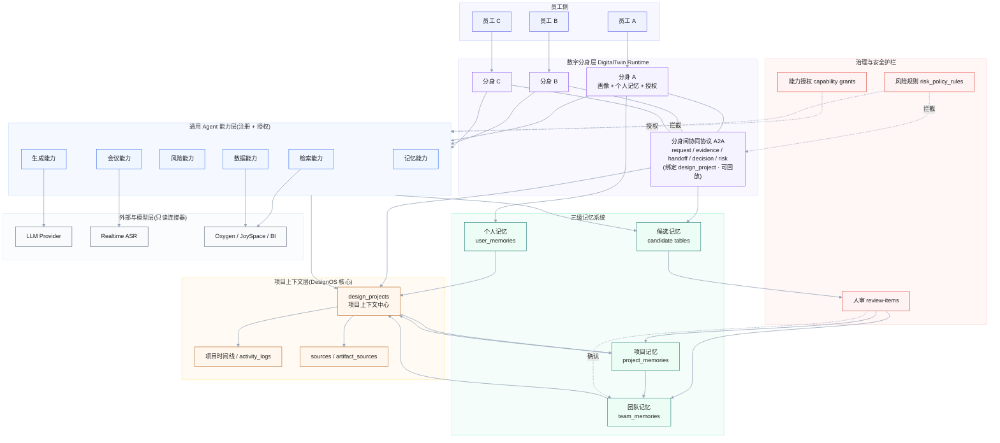
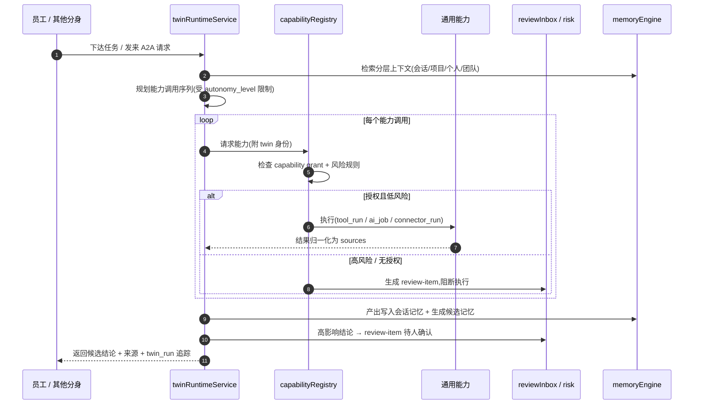
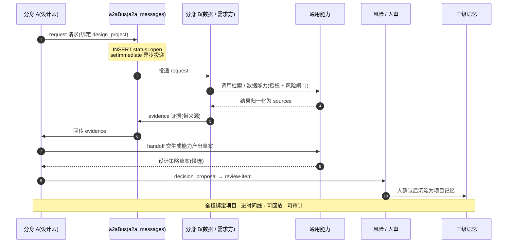
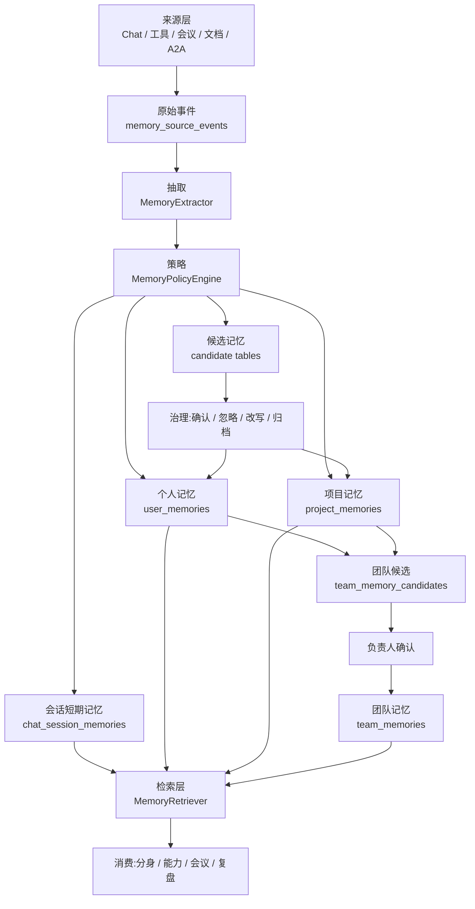

# 灵犀 Lingxi · 架构图与流程图(Mermaid 源码)

> 说明:以下为 Mermaid 文本源码,可直接粘贴到支持 Mermaid 的编辑器(Typora、VS Code、语雀、飞书文档、mermaid.live 等)渲染。
> 节点内换行统一使用 ` `(比 `\n` 兼容性更好)。

---

## 一、顶层架构图(flowchart)

> 优化说明:内容(节点/文字/连线)完全不变;仅通过 ① 每个子图内 `direction LR` 使同层节点横向成行、七层自上而下堆叠成整齐带状,② 为每层加浅色背景使其成为视觉整体,③ 统一连线样式,让整体更成体系。

---

## 二、运行时执行流(sequenceDiagram)

---

## 三、A2A 分身间协同时序(sequenceDiagram · 强调 Agent 沟通)

---

## 四、(可选)三级记忆治理流(flowchart)

