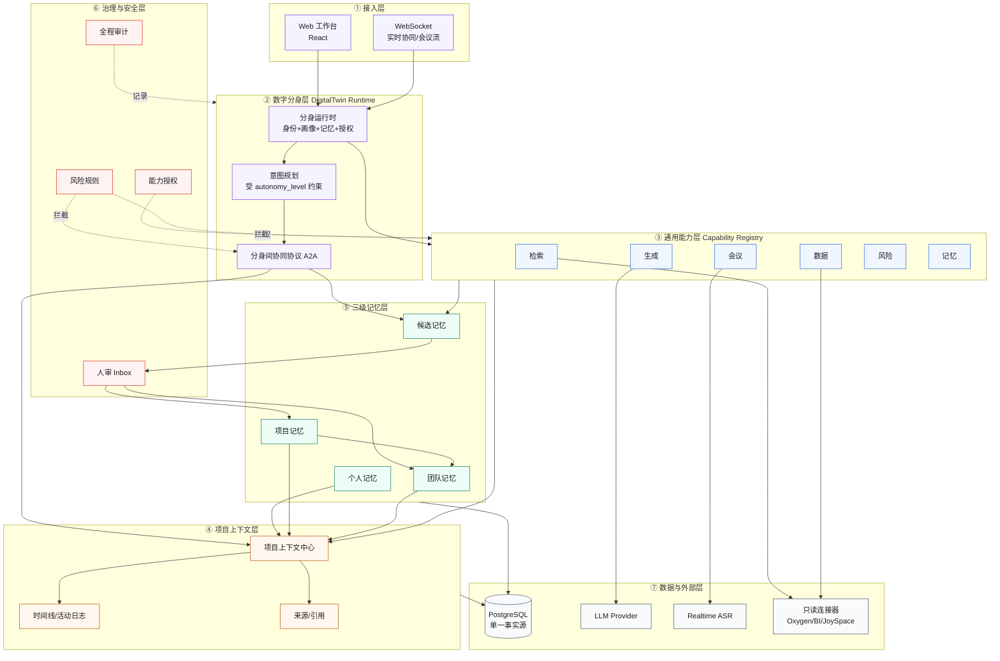
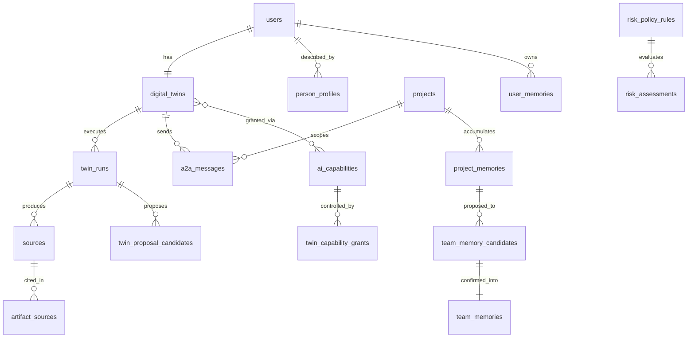

# 灵犀 Lingxi · 员工数字分身与自主协同平台 —— 基础框架

> 版本:v1.0(黑客松参赛版) · 日期:2026-07-10
> 定位:一个**独立**的 AI Native 组织协同平台,不是任何现有系统的插件。
> 血统:融合 DesignOS(设计全周期工作台,已验证)与 AgentMesh(多 Agent 协同原型,已验证)两套经过实战打磨的机制,重新组织为一个以"数字分身"为中心的独立产品。
> 本文是**面向开发落地的完整技术框架**:品牌、技术栈、系统分层、模块划分、数据模型、API、运行时、治理、部署、里程碑、黑客松 Demo 范围。

---

## 0. 品牌与一句话

| 维度 | 内容 |
|---|---|
| 中文名 | **灵犀** |
| 英文名 | **Lingxi** |
| 取义 | "心有灵犀一点通"——精准对应员工数字分身之间**无需繁琐沟通即可默契协同**的产品内核 |
| 一句话 | 为每位员工造一个**数字分身**,让它们调用系统通用能力、彼此自主协同、并把经验沉淀进**个人/项目/团队**三级记忆,使组织智能**自主生长**。 |
| Slogan | 中文:「每个人一个数字分身,组织智能自主生长」 · EN:"A twin for everyone. An intelligence that grows itself." |
| 备选名 | 双生 TwinOS / 协映 MeshMind(均可,推荐主用灵犀) |

**灵犀不是又一个聊天机器人**,而是一个组织级的"数字员工网络 + 记忆飞轮":每个数字分身代表一名真实员工,继承其画像与经验;分身之间像同事一样自主交流、分派与交接;所有有价值的产出经人确认后沉淀为组织资产,越用越聪明。

---

## 1. 产品形态与边界

### 1.1 是什么

灵犀是一个 **Web 平台 + 实时协同后端**,交付三种核心体验:

1. **数字分身工作台**:每位员工有一个绑定其画像与记忆的分身,在项目上下文里代其理解任务、调用能力、产出候选结论。
2. **通用 Agent 能力市场**:系统提供一组可授权调用的通用能力(检索、数据、生成、会议、风险、记忆),分身按需"雇佣"。
3. **三级记忆飞轮**:个人 / 项目 / 团队三级记忆,经人确认沉淀,反哺所有分身的后续工作。

### 1.2 不是什么(边界)

- 不是一个"全自动替人决策"的系统:分身自主产出的一律是**候选/提案**,改变组织事实的节点都停在**人确认**。
- 不是一个知识库工具:知识是分身工作的**副产物**,自动积累,而非要人手动维护。
- 不是把两个老项目缝在一起:灵犀是**单一技术栈、单一数据模型、单一事实源**的全新独立项目,只继承两者被验证过的**机制**。

### 1.3 首发场景与可迁移性

首发切入**设计全生命周期**(继承 DesignOS 的成熟业务骨架,Demo 最有说服力),但核心架构(分身 / 能力 / 协同 / 记忆 / 治理)是**领域无关**的,可平移到研发、运营、市场、售前等任何知识密集型团队。

---

## 2. 技术栈选型

灵犀作为独立项目,技术栈决策遵循一个原则:**选已被两个源项目验证、能在黑客松周期内落地、且企业可长期维护的成熟组合**,不为炫技引入未经验证的新框架。

| 层 | 选型 | 理由 |
|---|---|---|
| 前端 | React 18 + TypeScript + Vite + Ant Design + TailwindCSS | 继承 DesignOS 前端栈,企业级组件齐全,交付快 |
| 前端状态 | Zustand(客户端)+ React Query(服务端) | 已验证组合,简单可控 |
| 后端 | Node.js + Express + TypeScript | 与前端同语言,团队上手快;DesignOS 已跑通复杂业务 |
| 数据库 | PostgreSQL(**单一事实源**) | 关系 + jsonb + 未来 pgvector,一库满足结构化/半结构化/向量 |
| 实时 | `ws` WebSocket(挂载在同一 HTTP server) | 分身协同流、会议实时转写,已验证 |
| 异步任务 | DB 落盘异步(`INSERT → setImmediate → write-back`) | 复用 DesignOS `tool_runs`/`ai_jobs` 范式,**不引入独立消息队列** |
| AI | OpenAI 兼容 Provider(OpenAI / 京东云),含本地降级 | 多 Provider 可切换,失败有确定性兜底 |
| 语音 | Realtime ASR(Qwen/DashScope adapter,mock 默认) | 会议能力所需,可 mock 演示 |
| 检索增强 | keyword ILIKE 起步,`memory_embeddings` / pgvector 内生升级 | **不引入独立向量数据库基础设施** |

> **明确不用**:LangGraph / CrewAI 等重型 Agent 框架、独立消息队列、独立向量库、微服务全家桶。灵犀的"自主性"由清晰的 TypeScript 领域服务实现,而不是黑盒编排框架——这既是工程可控性,也是路演时的可信度。

---

## 3. 系统分层架构



七层各司其职:接入层负责人和分身的交互;分身层是灵魂;能力层是可调用的专家;上下文层让一切工作绑定到项目、可追溯;记忆层沉淀经验;治理层是自主性的护栏;数据与外部层提供事实源与外部能力。

---

## 4. 核心模块划分

后端采用 DDD 风格的 `modules/`(domain / application / transport 三层),超出单模块的通用逻辑放 `services/`。

```text
lingxi/
├── backend/
│   ├── src/
│   │   ├── modules/
│   │   │   ├── digital-twins/        # 分身运行时(核心)
│   │   │   │   ├── domain/           # twin / a2aMessage / collaborationState / capabilityIntent
│   │   │   │   ├── application/      # twinRuntimeService / capabilityRegistry / a2aBus / collaborationService
│   │   │   │   └── transport/        # twinRoutes / a2aRoutes / twinWs
│   │   │   ├── capabilities/         # 通用能力实现与授权
│   │   │   ├── memory/               # 三级记忆引擎(extractor/policy/retriever/governance)
│   │   │   ├── governance/           # 风险规则 + 人审 Inbox + 审计
│   │   │   ├── project-context/      # 项目上下文中心 + 时间线 + 来源
│   │   │   └── meetings/             # 会议 Copilot(转写/语义/建议)
│   │   ├── services/                # ai / connectors / sources / profileService ...
│   │   ├── routes/                  # 各 REST 路由挂载
│   │   ├── middleware/              # auth / roles / rateLimit
│   │   ├── scripts/                 # migrate / seed / sync / check-*
│   │   └── config/                  # 运行时配置 + 生产安全校验
│   └── package.json
├── frontend/
│   └── src/{pages, features, components, hooks, store, utils}
├── database/{init.sql, migrations/}
├── doc/                            # 方案、决策记录
└── scripts/                        # start/stop/status
```

模块职责一句话:

- **digital-twins**:分身身份、意图规划、能力调用编排、A2A 协同。系统的"灵魂"。
- **capabilities**:通用能力的注册、授权检查、执行落盘(能力市场)。
- **memory**:来源事件 → 抽取 → 策略 → 三级记忆 + 候选治理 + 分层检索。
- **governance**:风险规则、人审 Inbox(只读 UNION)、全程审计。护栏。
- **project-context**:让一切工作绑定项目、进时间线、带来源。
- **meetings**:实时转写、语义抽取、评分建议(会议是高价值记忆来源)。

---

## 5. 数据模型

单一 PostgreSQL,核心表(增量迁移,新字段可空以便演进):

**身份与分身**
- `users`、`teams`、`team_members`、`roles`
- `person_profiles`(行为画像:擅长领域、协作风格、活跃项目)
- `digital_twins`(每员工一个:persona_summary / profile_snapshot_id / autonomy_level / config)
- `twin_runs`(分身一次执行的落盘记录:trigger / intent / capability_calls / outputs / status)

**能力与授权**
- `ai_capabilities`(能力定义:name / category / provider / risk_level / autonomy_allowed / enabled)
- `twin_capability_grants`(按角色或单分身授权)
- `connector_definitions`、`connector_runs`(外部只读连接器及其调用记录)

**协同**
- `a2a_messages`(design_project_id / from_twin / to_twin / msg_type / ref / payload / status)

**项目与上下文**
- `projects`、`requirements`、`activity_logs`、`comments`、`chat_sessions`、`chat_messages`
- `sources` + `artifact_sources`(AI 产出的可追溯引用,`citation_status` 显式,严禁伪造)

**三级记忆**
- `user_memories`(个人)、`project_memories`(项目)、`team_memories`(团队)
- `chat_session_memories`(会话短期工作内存,~14d TTL)
- 候选:`tool_memory_candidates`、`meeting_memory_candidates`、`team_memory_candidates`、`twin_proposal_candidates`
- 审计:`memory_source_events`、`memory_events`、`memory_usage_logs`、`memory_relations`
- 预留:`memory_embeddings`(pgvector,向量/混合检索)

**治理**
- `risk_policy_rules`(category / signal / decision[allow/needs_review/block])
- `risk_assessments`(target / decision / findings)



---

## 6. API 面(REST + WebSocket)

**REST(节选)**

```text
# 分身
GET    /api/twins                      我的/团队分身列表
GET    /api/twins/:id                   分身详情(画像+授权+近期运行)
POST   /api/twins/:id/tasks             向分身下达任务(返回 202 + twin_run.id)
GET    /api/twins/runs/:runId           轮询分身运行结果与追踪

# 能力
GET    /api/capabilities                能力市场
PATCH  /api/capabilities/:id            admin 启停能力
GET    /api/twins/:id/grants            某分身的授权
PATCH  /api/twins/:id/grants            调整授权(admin/leader)

# 协同
GET    /api/projects/:id/a2a            项目内分身协同消息流
POST   /api/twins/:id/a2a               发起一条 A2A 消息

# 记忆
GET    /api/memory?scope=personal|project|team&project_id=...
POST   /api/memory                      手动录入
GET    /api/review-items                人审 Inbox(候选表只读 UNION)
POST   /api/review-items/:id/confirm    路由回各候选端点
POST   /api/review-items/:id/reject

# 项目/来源/风险
GET    /api/projects/:id/context        项目上下文中心
GET    /api/projects/:id/timeline
GET    /api/projects/:id/sources
GET    /api/risk/policies               风险规则(admin 可管理)
```

**WebSocket**

```text
/api/projects/:id/collab/stream         分身协同实时流(A2A 消息推送)
/api/meetings/:id/asr/realtime          会议实时转写
```

---

## 7. 关键运行时流程(摘要)

三条核心流程(详细时序见融合方案文档):

1. **分身运行时**:收到任务 → 检索分层记忆上下文 → 受 autonomy_level 约束规划能力调用 → 每次调用前查授权+风险 → 结果归一化为 sources → 产出写会话记忆 + 生成候选 → 高影响结论进人审 → 返回候选 + 追踪。
2. **分身间协同 A2A**:消息落盘(`a2a_messages` open)→ `setImmediate` 投递目标分身 → 写回 accepted/done;协同产物一律候选 + 人审;跨项目/批量/写团队记忆自动触发风险审核。
3. **三级记忆治理**:来源事件 → 抽取(标 confidence/scope/writePolicy)→ 策略引擎(只有低风险个人偏好 auto 写,其余候选)→ 人确认 → 沉淀;团队记忆必须 leader/admin 确认。

---

## 8. 安全与治理护栏(可信是灵犀的立身之本)

三条不可逾越的红线,贯穿所有自主行为:

1. **AI/分身产出不能单独作为事实源** —— 自主结论一律候选,需人确认。
2. **团队记忆必须人工确认** —— 个人/项目 → 团队只能走候选 + leader/admin 确认。
3. **外部连接器 V1 只读** —— 分身经只读连接器取证,任何外部写(上传/编辑/删除/批量)必须进人审。

配套机制:能力授权(高危能力默认不开放)、风险四信号(prompt 注入 / 来源策略 / 高危工具 / 需人批准)、全程审计(`activity_logs` + `memory_events` + `twin_runs` + `a2a_messages`)、来源可追溯(`sources` 不可伪造)。

> 这套护栏不是负担,而是**企业级可信 AI 的差异化卖点**:灵犀的每一个结论都能回答"从哪来、谁确认、能不能撤回"。

---

## 9. 部署与运行

- **开发**:`npm start`(前后端 + WS) / `npm run db:migrate` / `npm run db:seed`。
- **配置**:`backend/.env`——DB、JWT、AI Provider、ASR、CORS。生产启动拒绝弱 JWT / 默认库密码 / 通配 CORS。
- **凭证**:一律服务端环境变量,永不下发前端;连接器 token 脱敏。
- **容器化注意**:只读连接器依赖宿主 CLI 环境;容器化前需评估把连接器改为 HTTP 服务边界。
- **降级**:LLM/ASR 失败均有确定性本地兜底,记录 `fallback_reason`,不阻塞主流程。

---

## 10. 里程碑与路线图

| 阶段 | 目标 | 交付 |
|---|---|---|
| **黑客松 MVP** | 跑通"有画像有记忆的分身,受权调用能力,产出带来源候选,人确认沉淀" | 分身工作台 + 能力市场(检索/生成/记忆)+ 三级记忆 + 人审 Inbox |
| **Phase 1(试点)** | 单设计团队真实项目跑起来 | 会议能力接入、项目上下文中心、Oxygen 只读取证 |
| **Phase 2(协同)** | 分身间 A2A 受控协同闭环 | a2a_messages + 协同流 + 交接/证据/提案三类消息 |
| **Phase 3(自主)** | 灰度放开 autonomy_level=autonomous | 风险规则齐备后按能力灰度、后台 worker(默认关) |
| **Phase 4(平台化)** | 跨职能推广 + 能力开放 | 能力 SDK、跨团队记忆联邦、开放能力接入 |

---

## 11. 黑客松 Demo 范围(建议现场演示的最小闭环)

一条 3-5 分钟可讲完的端到端故事:

1. 设计师登录 → 看到自己的**数字分身**(带画像卡片:擅长/风格)。
2. 上传一份需求 PRD → 需求方分身发起协同 `request`,设计师分身接收(**分身间协同**可视化)。
3. 设计师分身自主调用**检索能力**(竞品/案例)+ **数据能力**(mock 指标)→ 产出**带来源**的设计策略草案(**候选**,非事实)。
4. 草案进**人审 Inbox** → 设计师一键确认 → 沉淀为**项目记忆**。
5. 展示**团队记忆飞轮**:一条被确认的复盘经验如何被下一个项目的分身检索复用。
6. 全程展示**审计追踪**:每个结论可回查来源与确认人。

> Demo 可用 mock 数据 + 本地 LLM 兜底,保证现场稳定;真实 Oxygen/ASR 作为"已具备"能力口头带过。

---

## 12. 技术风险与取舍

| 风险 | 取舍 |
|---|---|
| 自主性失控 | 默认 assisted,产出即候选;autonomous 灰度且过风险审核 |
| LLM 不稳定/超时 | 多 Provider + 本地确定性兜底,记录 fallback |
| 外部连接器耦合宿主 | V1 只读,写操作进人审;扩张时改 HTTP 边界 |
| 记忆膨胀/污染 | 候选治理 + 状态机(active/archived/superseded)+ 可撤回 |
| 黑客松周期紧 | 复用两个已验证项目机制,MVP 只做核心闭环,协同/自主后置 |

---

## 附:与两个源项目的关系

灵犀不复制任何一方的代码,只继承被验证的机制:

- 来自 **DesignOS**:项目上下文中心、四层记忆治理、tool_runs/ai_jobs 异步、sources/artifact_sources、review-items 只读 UNION、person_profiles 画像、只读连接器、会议 Copilot。
- 来自 **AgentMesh**:个人 Agent → 数字分身、Blackboard → A2A 协同、系统级通用 Agent、工具授权、风险四信号、Inbox 人审。
- 灵犀新增:数字分身运行时、autonomy_level 分级自主、能力市场、A2A 落盘协同、分身溯源记忆。
